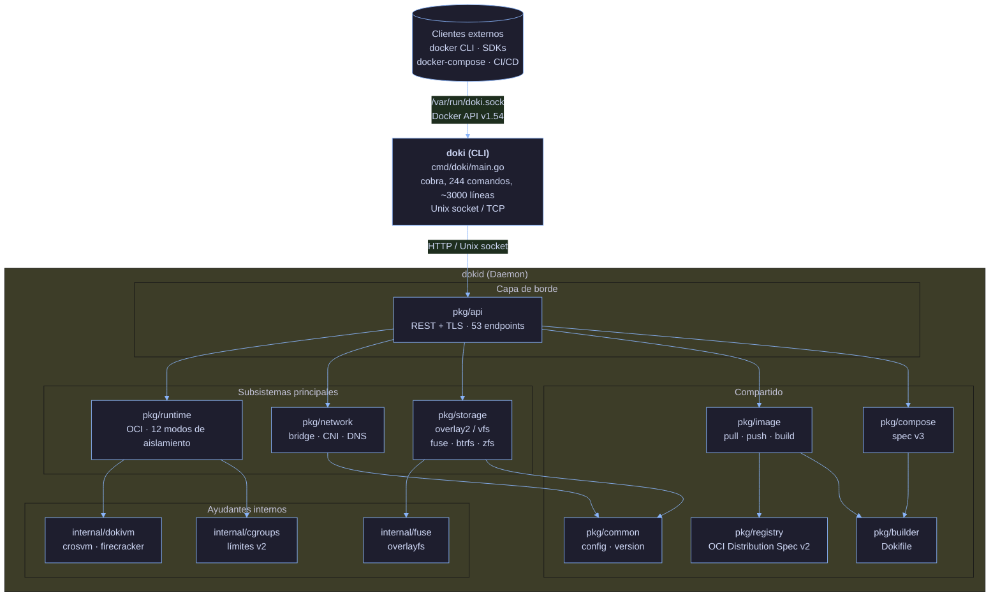
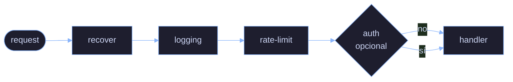

# Arquitectura

Esta página explica cómo está estructurado Doki internamente. Complementa la visión general de alto nivel de [Arquitectura del README](../README.md#arquitectura) con detalle más profundo para contribuidores y usuarios curiosos.

## Diagrama de alto nivel



## Recorrido por subsistemas

### 1. `pkg/api` — Docker Engine API v1.54

La cara pública del daemon. Implementa 53 endpoints que coinciden con la Docker Engine API:

| Grupo | Endpoints | Fuente |
|:------|:----------|:-------|
| Containers | 16 | `pkg/api/containers.go` |
| Images | 8 | `pkg/api/images.go` |
| Networks | 6 | `pkg/api/networks.go` |
| Volumes | 4 | `pkg/api/volumes.go` |
| System | 6 | `pkg/api/system.go` |
| Exec | 3 | `pkg/api/exec.go` |
| Auth | 1 | `pkg/api/auth.go` |
| Otros (events, info, version) | 9 | `pkg/api/misc.go` |

Construido sobre `gorilla/mux` para routing y `net/http` de stdlib. Cadena de middleware:



TLS está soportado vía variables `DOKI_TLS`/`DOKI_TLS_CERT`/`DOKI_TLS_KEY` o el bloque `tls` en `config.json`. mTLS se soporta con `tls.client_ca`.

### 2. `pkg/runtime` — OCI Runtime

Implementa la [OCI Runtime Spec](https://github.com/opencontainers/runtime-spec). El struct `Runtime` contiene:

```go
type Runtime struct {
    mu       sync.RWMutex
    root     string         // state root
    store    *storage.Manager
    nsMgr    *namespaces.Manager  // solo linux
    cgMgr    *cgroups.Manager     // solo linux
    prootMgr *proot.Manager       // fallback para Android
    rootless bool
    mode     ExecutionMode
    dnsAddr  string
}
```

Cuando se llama a `Run(cfg)`, el pipeline es:

1. **Setup de red** (`pkg/network.SetupNetwork`): crear par veth, attach al bridge, asignar IP, registrar DNS
2. **Pull de imagen** (o usar capas en caché): vía `pkg/registry` y `pkg/image`
3. **Extraer rootfs**: tar con manejo de whiteouts, protección contra path traversal
4. **Seleccionar runner**: `detectMode()` devuelve el mejor disponible de los 12 niveles
5. **Despachar al runner**: `startProcess()` invoca el runner elegido
6. **Registrar estado**: escribe `state.json` atómicamente
7. **Monitorear**: espera el exit del proceso, captura exit code, escribe logs

#### 12 Runners (auto-detección)

El `pkg/runtime/registry.go` prueba cada uno:

| Prioridad | Modo | Probe |
|:----------|:-----|:------|
| 1 | pKVM/Microdroid | `/dev/kvm` legible + Android 15+ |
| 2 | MicroVM | `/dev/kvm` legible + `crosvm`/`firecracker` en `$PATH` |
| 3 | Sysbox | `sysbox-runc` en `$PATH` |
| 4 | Namespaces | `unshare` funciona |
| 5 | gVisor | `runsc` en `$PATH` |
| 6 | FEX-Emu | `FEXInterpreter` o `box64` en `$PATH` |
| 7 | QEMU User | `qemu-*-static` en `$PATH` |
| 8 | Proot | `proot` en `$PATH` (o distribuido) |
| 9 | Legacy32 | `binfmt_misc` registrado + qemu multiarch |
| 10 | Chroot | siempre |
| 11 | WASM | `wasmedge` o `iwasm` en `$PATH` |
| 12 | Native | siempre (fallback) |

Fuerza un modo específico con `doki run --runtime <mode>`. El registro de runners recorre de arriba a abajo y devuelve el primero que pase su probe.

### 3. `pkg/network` — Networking de contenedores

Implementa networking bridge, plugins CNI, port mapping y DNS interno.

#### Bridge (`doki0`)

- Bridge Linux por defecto con subnet `10.0.0.0/24` (configurable)
- Reglas iptables para NAT (MASQUERADE en outbound) y DNAT (port forwarding)
- Pares veth: host-side `veth*`, container-side `eth0`
- v0.9.3: campos `Endpoint.VethHost`/`VethPeer` rastrean nombres para teardown apropiado

#### DNS

- Escucha en `127.0.0.11:53` (Linux) o `127.0.0.11:8053` (Android)
- Caché LRU (1024 entradas, TTL 5 min)
- Registros A, AAAA, PTR
- ndots:0 por defecto en el resolv.conf generado
- Reintento TCP en bit TC (RFC 5966)
- Registro vía `SetupNetwork`, re-registro vía `ReRegisterDNS` al reiniciar el daemon

#### Plugins CNI

- bridge, host-local, portmap, macvlan, ipvlan, dhcp, vlan
- El gestor de plugins existe en `pkg/network/cni.go` (no completamente conectado — ver [Limitaciones conocidas](../README.md#qu%C3%A9-no-funciona-todav%C3%ADa))

#### Rootless (pasta)

Para usuarios sin root, la utilidad [pasta](https://passt.top/) proporciona conectividad TCP/UDP sin dispositivos TAP. El `pkg/network/rootless.go` de Doki llama a `pasta` para port forwarding.

#### DokiLink-Lite (Mesh Networking)

v0.10.0 introduce DokiLink-Lite, una red mesh peer-to-peer con tres capas de encriptación:

- **L1 (TLS 1.3)**: Por defecto. CA ECDSA P-2-256 por instalación, certificados de enlace con nombres DNS SAN.
- **L2 (NaCl secretbox)**: Opcional via `DOKI_LINK_PAYLOAD_ENC=1`. Deriva key de 32 bytes de las public keys Ed25519 de ambos peers.
- **L3 (Noise protocol)**: Futuro.

Componentes clave:
- `pkg/netlink/proxy.go` — Proxy TCP/UDP (reemplaza socat)
- `pkg/netlink/crypto.go` — Wrapper TLS + secretbox
- `pkg/netlink/keys.go` — Generación de keypair Ed25519 + CA
- `pkg/netlink/peer.go` — Modelo de confianza TOFU
- `pkg/netlink/mesh.go` — Protocolo gossip para descubrimiento de peers

### 4. `pkg/storage` — Drivers de Storage

Cinco drivers, auto-detectados por `DetectBestDriver()`:

| Driver | Caso de uso | Camino de código |
|:-------|:-----------|:----------------|
| `overlay2` | Linux con soporte de kernel | `syscall.Mount("overlay", ...)` |
| `fuse-overlayfs` | Rootless, Termux, Android | Mount FUSE userspace |
| `btrfs` | Root btrfs | subvolúmenes + snapshots |
| `zfs` | Pools ZFS | datasets + snapshots |
| `vfs` | Fallback (testing) | copia de directorio |

Store de capas content-addressable: capas almacenadas por SHA256 en `~/.doki/layers/`. Metadata de imágenes en `~/.doki/images/`. Estado de contenedores en `~/.doki/containers/<id>/state.json`.

### 5. `pkg/image` — Operaciones de imagen OCI

- Pull: `Pull(ref)` llama a `pkg/registry` para el manifest, luego descarga cada capa en paralelo
- Push: `Push(ref)` sube blobs (con optimización cross-repo mount), luego pone el manifest
- Build: `Build(dokifile)` corre el parser de Dokifile de 18 instrucciones
- Inspect: `Inspect(ref)` devuelve config OCI de la imagen + manifest

### 6. `pkg/registry` — Cliente OCI Distribution Spec

Implementa [OCI Distribution Spec v1.1](https://github.com/opencontainers/distribution-spec/blob/main/spec.md):

- `GET /v2/<name>/manifests/<reference>` — fetch manifest
- `HEAD /v2/<name>/manifests/<reference>` — chequea existencia
- `GET /v2/<name>/blobs/<digest>` — fetch blob (con soporte Range para resumption)
- `POST /v2/<name>/blobs/uploads/` — inicia upload
- `PATCH /v2/<name>/blobs/uploads/<uuid>` — sube chunk
- `PUT /v2/<name>/blobs/uploads/<uuid>?digest=...` — finaliza
- Cross-repo mount: intenta `?<mount=<digest>&from=<otro-repo>` para evitar re-subir
- Auth: Bearer token, Basic, con parsing de challenge WWW-Authenticate

### 7. `pkg/compose` — Motor de Compose

Parsea Compose Spec v3 (la mayoría de los campos). El entry point principal es `pkg/compose/compose.go`:

```go
type Project struct {
    Name     string
    Services map[string]*Service
    Networks map[string]*Network
    Volumes  map[string]*Volume
    Secrets  map[string]*Secret
}

func (p *Project) Up(ctx context.Context, opts UpOptions) error
func (p *Project) Down(ctx context.Context, opts DownOptions) error
func (p *Project) Ps(ctx context.Context) ([]ContainerStatus, error)
```

Depende de: `pkg/api` (habla con el daemon), `pkg/common` (config).

### 8. `internal/dokivm` — Subsistema MicroVM

Envuelve crosvm (Chromium OS Virtual Machine Monitor) y Firecracker. Proporciona:

- `crosvm.go` — lanzador crosvm (usado en chips Qualcomm/MediaTek/Samsung/Google con Gunyah/GenieZone/Halla/KVM)
- `firecracker.go` — lanzador Firecracker (servidores Intel/AMD)
- `qemu.go` — fallback QEMU cuando ninguno está disponible
- `kernel/` — kernel prebuilt + initrd en `kernels/`

### 9. `internal/fuse`, `internal/namespaces`, `internal/cgroups`, `internal/seccomp`, `internal/apparmor`

Subsistemas específicos de Linux. `fuse` hace mounts overlayfs (alternativa userspace a kernel overlay). `namespaces` crea namespaces user/pid/net/mount/uts/ipc vía `unshare`/`clone`. `cgroups` es gestión de recursos v2. `seccomp` construye programas de filtro BPF. `apparmor` genera texto de perfil.

En darwin, `internal/fuse/overlayfs_darwin.go` e `internal/namespaces/stub_darwin.go` son stubs no-op (añadidos en v0.9.3).

### 10. `pkg/common` — Código compartido

- `common.Version`, `common.DokiVersion`, `common.DokiAPIVersion`, `common.GitCommit`, `common.BuildDate` — seteados vía `-ldflags` al compilar
- `common.StripHostEnv()` — filtra `LD_PRELOAD`/`LD_LIBRARY_PATH`
- `common.Container` — el struct de contenedor a nivel de wire
- `common.Image` — el struct de imagen a nivel de wire
- `common.Network`, `common.Volume`, `common.Port`, `common.Mount` — sub-tipos

## Modelo de concurrencia

El daemon de Doki es multi-goroutine pero usa un solo thread de OS para I/O dispatch (`runtime.GOMAXPROCS(1)` NO está seteado; sigue el default de Go). Puntos clave de sincronización:

| Recurso | Lock | Ubicación |
|:--------|:-----|:----------|
| Estado de contenedor | `sync.RWMutex` por contenedor | `pkg/runtime/state.go` |
| Caché LRU de DNS | `sync.Mutex` | `pkg/network/dns.go` |
| Registro de redes | `sync.RWMutex` | `pkg/network/manager.go` |
| Caché de capas de storage | `sync.Map` | `pkg/storage/cache.go` |
| Rate limiter de API | `sync.Mutex` por IP | `pkg/api/ratelimit.go` |

Las secciones críticas son cortas; las operaciones largas (extracción, setup de red) ocurren fuera del lock con semántica copy-on-write.

## Secuencia de arranque

Arranque de `dokid`:

1. Carga `~/.doki/config.json` (o el default de la plataforma)
2. Inicializa el logger (`log/slog`, JSON o text basado en TTY de stderr)
3. Configura el driver de storage (`DetectBestDriver()`)
4. Inicializa los subsistemas de runtime, network, DNS
5. Carga el estado guardado de `state.json`
6. `recoverContainers`: para cada contenedor guardado, re-registra endpoints de red y entradas DNS
7. Inicia el servidor HTTP en el Unix socket (o TCP si está configurado)
8. Inicia el servidor DNS en `DOKI_DNS_LISTEN`
9. Bloquea en señal

## ¿Por qué esta arquitectura?

Tres principios guiaron el diseño:

1. **Compatibilidad drop-in con Docker** — la API es 1:1 con Docker, así que el tooling existente (docker-py, dockerode, pipelines CI/CD) funciona sin modificación. Por eso `pkg/api` es un subsistema separado y no un wrapper delgado sobre una API interna.

2. **Compliance OCI** — pull/push/runtime/build todos usan specs OCI. Doki puede hablar con cualquier registry OCI, correr cualquier imagen OCI, y emitir bundles de runtime OCI.

3. **Restricciones de recursos primero** — Termux, Android, Raspberry Pi son los targets primarios. La memoria es preciosa, así que el daemon idle usa 12 MB y el CLI 6.7 MB. Por eso usamos `log/slog` en vez de zap/zerolog (slog es stdlib, sin dependencia), por qué incluimos detección de proot, y por qué `fuse-overlayfs` es el driver de storage por defecto.

## Stats del código fuente (v0.10.0)

- 126 archivos fuente Go (solo contando `*.go` fuera de tests y archivos generados)
- 46.578 líneas de código Go (37.564 producción + 9.014 tests)
- 4 binarios compilados (`doki`, `dokid`, `doki-compose`, `doki-init`)
- 244 comandos CLI
- 5 archivos de release (android-arm64, android-armv7, linux-arm64, linux-armv7, darwin-arm64)
- 0 dependencias CGo en runtime

## Siguientes pasos

- [Niveles de aislamiento](Isolation-Levels.es) — cada uno de los 12 modos en detalle
- [Networking](Networking.es) — bridge, CNI, DNS, iptables en profundidad
- [Storage](Storage.es) — internos de los drivers
- [Seguridad](Security.es) — seccomp, capabilities, modelo de amenaza
