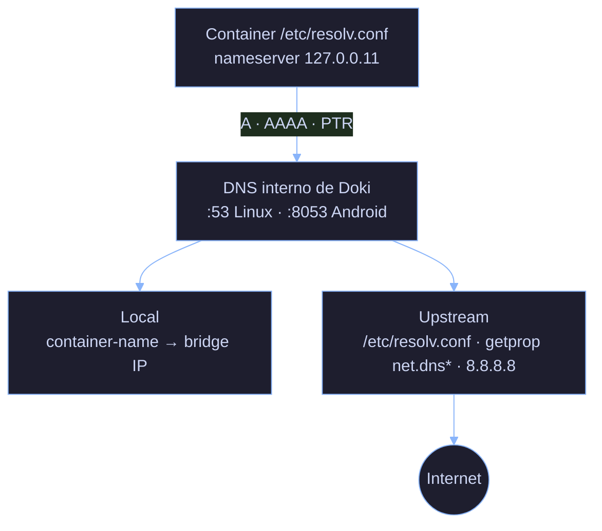
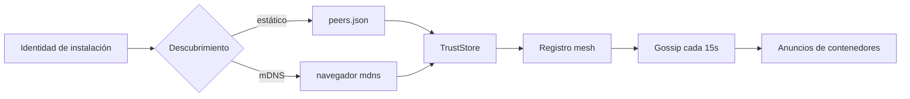

# Networking

El stack de networking de Doki proporciona redes bridge, soporte para plugins CNI, port mapping, un servidor DNS interno, y networking mesh peer-to-peer DokiLink-Lite (v0.9.3).

## Tipos de red

| Tipo | Descripción | Driver |
|:-----|:------------|:-------|
| **bridge** | Bridge `doki0` por defecto con NAT, DNS, port mapping | Linux bridge + iptables |
| **host** | Comparte el namespace de red del host | (sin driver) |
| **none** | Solo loopback | (sin driver) |
| **overlay** | Multi-host (planeado) | vxlan |
| **macvlan** | Acceso directo a la NIC del host | macvlan |
| **ipvlan** | Aislamiento L3 | ipvlan |

### Bridge por defecto: `doki0`

Al primer arranque, el daemon crea un bridge Linux llamado `doki0` con esta config:

| Propiedad | Default |
|:-----------|:--------|
| Subnet | `10.0.0.0/24` |
| Gateway | `10.0.0.1` |
| MTU | 1500 |
| Asignación de IP | Secuencial (`.2`, `.3`, ...) |
| iptables | MASQUERADE en outbound, DNAT en port forward |

Sobrescribe en `config.json`:

```json
{
  "network": {
    "bridge": "doki0",
    "default_subnet": "10.1.0.0/24",
    "mtu": 1500,
    "ipv6": false
  }
}
```

### Attach de contenedor

Cuando se inicia un contenedor con `--network bridge`, el daemon:

1. Crea un par veth (`veth<random>` ↔ `eth0` dentro del contenedor)
2. Attach el veth del lado host a `doki0`
3. Asigna una IP de la subnet
4. Configura reglas iptables
5. Registra el nombre del contenedor en el DNS interno

### Red Host

`--network host` salta el bridge y le da al contenedor el namespace de red del host. El contenedor ve todas las interfaces e IPs del host. No se necesita port mapping (`-p` es no-op).

El rendimiento es el mejor de todos los modos. Seguridad: el menos aislado — el contenedor puede sniffear todo el tráfico del host.

### None

`--network none` le da al contenedor solo `lo`. Sin red externa. Útil para procesamiento batch, cargas sensibles a seguridad.

## Port Mapping

### Sintaxis

```bash
-p HOST_IP:HOST_PORT:CONTAINER_PORT/PROTOCOL
-p HOST_PORT:CONTAINER_PORT
-p CONTAINER_PORT   # puerto host aleatorio (usa -P para publicar todos los EXPOSE)
```

### Ejemplos

```bash
# Mapea host 8080 a container 80
doki run -p 8080:80 nginx:alpine

# Bind a IP específica del host
doki run -p 127.0.0.1:8080:80 nginx:alpine

# Múltiples protocolos
doki run -p 8080:80/tcp -p 8080:80/udp my-server:latest

# Publica todos los puertos EXPOSE
doki run -P nginx:alpine

# Rango de puertos
doki run -p 8080-8090:80 my-server:latest
```

### Cómo funciona (rootful)

1. `iptables -t nat -A DOKI -p tcp --dport 8080 -j DNAT --to-destination 10.0.0.2:80` (fix v0.9.2)
2. `iptables -t nat -A POSTROUTING -s 10.0.0.2 -j MASQUERADE` (para el camino de retorno)
3. `socat` para el proxy TCP real en modo rootless

### Fix iptables DNAT de v0.9.2

La construcción de la regla DNAT en `pkg/network/manager.go` usaba `strings.Split` y le faltaba el flag `-A` (append) en v0.9.1:

```diff
- args := strings.Split("OUTPUT -p tcp --dport 8080 -j DNAT --to-destination 10.0.0.2:80", " ")
- exec.Command("iptables", args...).Run()  // error descartado
+ args := []string{
+     "-A", "OUTPUT",
+     "-p", "tcp",
+     "--dport", "8080",
+     "-j", "DNAT",
+     "--to-destination", "10.0.0.2:80",
+ }
+ out, err := exec.Command("iptables", args...).CombinedOutput()
+ if err != nil {
+     return fmt.Errorf("iptables DNAT: %s: %w", out, err)
+ }
```

Dos cosas arregladas:

1. **Flag `-A`**: v0.9.1 tenía `OUTPUT` como primer arg, que iptables interpretaba como el nombre de la tabla. El fix usa `[]string` e incluye `-A` correctamente.
2. **Chequeo de error**: v0.9.1 llamaba `.Run()` y descartaba el error. El fix usa `.CombinedOutput()` y envuelve el error.

La chain DOKI ahora también se auto-crea en `pkg/network/cni.go:ensureChains()` (idempotente — seguro llamarla en cada start de contenedor).

### Fix de port-forwarding de v0.9.2

El proxy `socat` rootless se conectaba a `localhost:containerPort` en lugar de `containerIP:containerPort`:

```diff
- socatArgs := []string{
-     "TCP-LISTEN:8080,reuseaddr,fork",
-     "TCP:localhost:80",   // ← mal: localhost desde host ≠ contenedor
- }
+ socatArgs := []string{
+     "TCP-LISTEN:8080,reuseaddr,fork",
+     "TCP:10.0.0.2:80",    // ← IP bridge del contenedor
+ }
```

### Soporte UDP (v0.9.2)

Port forwarding UDP ahora está soportado vía `socat -u`:

```go
if port.Type == "udp" {
    socatArgs = append(socatArgs[:2],
        append([]string{"UDP-LISTEN:8080,reuseaddr,fork"},
               "UDP:10.0.0.2:80")...)
}
```

## DNS interno

Doki corre un servidor DNS interno que maneja:

- Resolución de nombres entre contenedores (`db` → `10.0.0.2`)
- Registros A (IPv4)
- Registros AAAA (IPv6)
- Registros PTR (DNS inverso)
- Forwarding a resolvers upstream

### Arquitectura



### Defaults (v0.9.2)

| Plataforma | Listen por defecto | Por qué |
|:-----------|:-------------------|:-------|
| Linux | `127.0.0.11:53` | Puerto estándar sin privilegios |
| Android (Termux) | `127.0.0.11:8053` | Puerto 53 bloqueado por SELinux |
| macOS | no se usa (ModeNative) | Sin bridge |

Sobrescribe con `DOKI_DNS_LISTEN=IP:PORT`.

### Resolución de nombres

```bash
$ doki network create backend
$ doki run -d --name db --network backend postgres:alpine
$ doki run -d --name api --network backend my-api:latest

# Desde dentro del contenedor api:
$ doki exec api sh -c 'getent hosts db'
172.20.0.2      db.backend

# Desde el host (vía el CLI doki):
$ doki network inspect backend
[
  {
    "Name": "backend",
    "Id": "abc123",
    "Containers": {
      "db": {"EndpointID": "...", "IPv4Address": "172.20.0.2"},
      "api": {"EndpointID": "...", "IPv4Address": "172.20.0.3"}
    }
  }
]
```

Los aliases se pueden setear con `doki network connect --alias db postgres backend`.

### Caché LRU

El servidor DNS tiene una caché LRU integrada:

- 1024 entradas
- TTL de 5 minutos por entrada
- Re-registrada al reiniciar el contenedor

### Fixes clave de v0.9.2

| Archivo | Bug | Fix |
|:--------|:----|:----|
| `pkg/network/dns.go` | Busy-wait en `SetReadDeadline` | `ReadFromUDP` bloquea naturalmente |
| `pkg/common/resolv.go` | Almacenaba `:port` en nameservers | Stripped, appended `:53` para dialling |
| `pkg/network/manager.go` | DNS no registrado al iniciar contenedor | `SetupNetwork` llama a `AddEntry` |
| `cmd/dokid/main.go` | Usaba `:53` en Android (bloqueado) | Usa `:8053` en Android |
| `pkg/network/dns.go` | Sin AAAA, sin PTR | Añadidos ambos |
| `pkg/common/resolv.go` | ndots:5 causaba loops de retry | ndots:0 por defecto |
| `pkg/network/dns.go` | Solo UDP | Reintento TCP en bit TC (RFC 5966) |
| `pkg/network/manager.go` | DNS perdido al reiniciar daemon | `recoverContainers` llama a `ReRegisterDNS` |

## Plugins CNI

CNI (Container Network Interface) es una spec para networking pluggable. Doki soporta estos plugins:

| Plugin | Propósito |
|:-------|:----------|
| `bridge` | Bridge Linux (default) |
| `host-local` | Asignación local de IP |
| `portmap` | Port mapping |
| `macvlan` | Acceso directo a NIC del host |
| `ipvlan` | Aislamiento L3 |
| `dhcp` | Asignación de IP basada en DHCP |
| `vlan` | Tagging 802.1Q VLAN |

CNI se habilita con `DOKI_CNI=/path/to/cni/conf`. El modo bridge por defecto no usa CNI directamente (más rápido, sin overhead de plugin).

**Estado**: El gestor de plugins existe, no está completamente conectado al runtime. Ver [Limitaciones conocidas](../README.md#qu%C3%A9-no-funciona-todav%C3%ADa).

## Networking rootless (pasta)

Para usuarios sin root, Doki usa [pasta](https://passt.top/) (la herramienta "pasta", sucesora de slirp4netns). Pasta:

- Conectividad TCP/UDP sin root ni dispositivos TAP
- Modo ICS (Internet Connection Sharing)
- Servidor DHCP integrado para el contenedor
- Los bind mounts funcionan normalmente

Uso:

```bash
# pasta se auto-detecta en $PATH
# o setea DOKI_PASTA=/path/to/pasta
doki run --rm --network bridge alpine ping -c 1 8.8.8.8
```

Pasta escucha en la interfaz externa del host y hace NAT del tráfico para el contenedor. El rendimiento es ~95% del nativo (vs 70% para slirp4netns).

## IPv6

Habilita en el bridge por defecto:

```json
{
  "network": {
    "ipv6": true
  }
}
```

O crea una red IPv6 explícitamente:

```bash
doki network create --ipv6 --subnet fd00::/64 ipv6-net
```

Doki asigna direcciones v4 y v6 cuando `ipv6: true`.

## Teardown de veth (fix v0.9.2)

Cuando se elimina un contenedor, su par veth debe ser eliminado para evitar filtrar interfaces en el host. v0.9.2 añadió tracking:

```go
// pkg/network/manager.go
type Endpoint struct {
    // ...campos existentes...
    VethHost string  // nombre de interfaz del lado host (ej. "vethabc123")
    VethPeer string  // nombre de interfaz del lado container (ej. "eth0")
}
```

`teardownBridgeNetwork()` ahora hace:

```go
// Elimina ambos extremos veth
exec.Command("ip", "link", "del", endpoint.VethHost).Run()
// (VethPeer se va automáticamente con el par)

// Luego elimina el bridge
exec.Command("ip", "link", "del", bridgeName).Run()
```

Antes de v0.9.2: `ip link` mostraba decenas de interfaces `veth*` después de correr unos cuantos contenedores.

## Consideraciones de seguridad

| Preocupación | Mitigación |
|:-------------|:-----------|
| Contenedor sniffeando tráfico del host | Usa `--network bridge` (default), no `host` |
| Contenedor escapando vía manipulación de iptables | La chain DOKI está namespaced, separada de las reglas del sistema |
| DNS spoofing | Las respuestas DNS están bound a la IP del contenedor |
| Port hijacking | El primer contenedor en reclamar un puerto del host gana; el segundo falla con EADDRINUSE |
| ARP spoofing | Doki habilita `arp_ignore`/`arp_announce` en las interfaces veth |

## Rendimiento

| Modo | Throughput | Overhead de latencia |
|:-----|:-----------|:--------------------|
| `bridge` (rootful) | 95% nativo | <0.1ms |
| `bridge` (rootless, pasta) | 90% nativo | ~0.2ms |
| `host` | 100% nativo | 0ms |
| `none` | (sin red) | n/a |

## Fuente

- `pkg/network/manager.go` — bridge, port forwarding, veth, teardown
- `pkg/network/cni.go` — gestor de plugins CNI, chain DOKI
- `pkg/network/dns.go` — servidor DNS interno
- `pkg/network/android_dns.go` — descubrimiento DNS en Android
- `pkg/network/rootless.go` — integración con pasta
- `pkg/common/resolv.go` — parsing de resolv.conf
- `pkg/netlink/proxy.go` — reenviador TCP (reemplaza socat)
- `pkg/netlink/udp.go` — reenviador UDP con mapa de sesiones
- `pkg/netlink/keys.go` — identidad de instalación, Ed25519 + ECDSA P-256
- `pkg/netlink/crypto.go` — envolturas TLS 1.3 y NaCl secretbox
- `pkg/netlink/peer.go` — registro de pares y almacén de confianza
- `pkg/netlink/mesh.go` — protocolo gossip, registro de pares, enrutador mesh
- `pkg/netlink/discovery_static.go` — cargador de `peers.json`
- `pkg/netlink/discovery_mdns_{on,off}.go` — servicio mDNS (opt-in)

## DokiLink-Lite (Mesh Multi-Host)

Doki 0.9.3 introduce **DokiLink-Lite**: una capa de proxy TCP/UDP +
descubrimiento mesh que permite reenviar un puerto publicado de un
contenedor a otra instancia Doki en la misma LAN (o más allá, si
configura pares estáticos manualmente). Es intencionalmente mínimo:
sin gVisor, sin stack completo de WireGuard, sin NAT traversal, sin
servidor de retransmisión.

### Capas de Cifrado

| Capa | Cuándo | Librería | Notas |
|:-----|:-------|:---------|:------|
| L0 (ninguna) | solo loopback | — | por defecto en Android/Termux |
| L1 (TLS 1.3) | cualquier inter-host | `crypto/tls` stdlib | por defecto, firmado por CA por instalación |
| L2 (secretbox) | solo payload | `golang.org/x/crypto/nacl/secretbox` | opt-in con `DOKI_LINK_PAYLOAD_ENC=1`, clave derivada de las pubkeys Ed25519 de ambos pares |

### Arquitectura

```mermaid
sequenceDiagram
    participant Cliente
    participant DokiA as Doki (A)
    participant TLS as TLS 1.3
    participant Box as secretbox
    participant DokiB as Doki (B)
    participant Contenedor

    Cliente->>DokiA: dial :9090
    DokiA->>TLS: WrapServer (L1)
    TLS->>Box: WrapServer (L2, opt-in)
    Box->>DokiB: reenvío TCP
    DokiB->>Contenedor: dial :8080
    Contenedor-->>DokiB: respuesta
    DokiB-->>Box: reenviar de vuelta
    Box-->>TLS: reenviar de vuelta
    TLS-->>DokiA: reenviar de vuelta
    DokiA-->>Cliente: respuesta
```

### Descubrimiento de Pares



### CLI

```bash
# Inspeccionar la identidad local de instalación.
doki mesh status
# install id:    fndwnv3mn7dt
# public key:    K0dm12xvxzUTBZ3lJkOcOyBrGPPNlCWpTJhcEv0BQys=
# ca fingerprint: cc4165e0ef4c
# ca expires:    2027-06-07

# Agregar un par estático.
doki link add mybuddy 192.168.1.42:7432 --pub "$(doki mesh status | awk '/public key/ {print $3}')"

# Listar pares.
doki mesh ls
# PEER ID    NAME       ADDRESS            LAST SEEN
# mybuddy    mybuddy    192.168.1.42:7432  2s

# Eliminar un par.
doki link rm mybuddy
```

### Limitaciones (lea antes de desplegar)

1. **Sin NAT traversal, sin relay**: DokiLink solo funciona cuando
   ambos pares pueden alcanzarse en el puerto de gossip (por defecto
   `:7432`). Para escenarios cross-NAT, ejecute primero una
   superposición Tailscale / Nebula.
2. **mDNS solo en LAN**: construido con `-tags netlink_mdns`. Las
   builds por defecto incluyen un stub. Use pares estáticos para
   cross-VLAN.
3. **El framing secretbox por datagrama** tiene 24 bytes de nonce
   + 16 bytes de overhead — las cargas UDP pesadas pagan un costo
   fijo por paquete.
4. **Sin DHT, sin auto-descubrimiento más allá de mDNS / JSON
   estático**: el `peers.json` es la única fuente de verdad para
   pares entre redes.
5. **El contenedor ve la red del host** en modo proot+Termux: el
   reenvío DokiLink es un relevo TCP/UDP en el loopback del host,
   no un puente de namespaces de red. Los contenedores en modo
   `proot` ya pueden alcanzar cualquier servicio del host, así que
   el proxy no añade una frontera de seguridad en ese modo.
6. **El protocolo de cable es JSON, limitado a 4 KiB por mensaje**:
   gRPC / protobuf es una característica futura de v0.11+.
7. **Vida útil de la CA: 365 días, certificados de enlace 90
   días**: re-emita con `doki mesh status` para confirmar expiración.
   La herramienta de rotación está planificada para v0.10.
