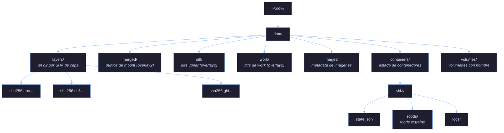

# Storage

Doki soporta 5 drivers de storage, auto-detectados por `DetectBestDriver()`. El driver elegido depende de tu kernel, filesystem y si tienes root.

## Comparación de drivers

| Driver | Caso de uso | Requiere root | Rendimiento | Estado |
|:-------|:-----------|:--------------|:------------|:-------|
| `overlay2` | Servidores Linux con kernel overlay | Sí (para mount) | Mejor (kernel nativo) | Testeado |
| `fuse-overlayfs` | Rootless, Termux, Android | No | ~90% de overlay2 | Testeado |
| `btrfs` | Sistemas con root btrfs | No (subvolúmenes) | Mejor (con snapshots) | No testeado |
| `zfs` | Sistemas con pools ZFS | No (datasets) | Mejor (con snapshots) | No testeado |
| `vfs` | Fallback, testing | No | El más lento (copia on read) | Testeado |

## Auto-detección

```go
// pkg/storage/driver.go
func DetectBestDriver(root string) string {
    if canUseOverlay2() {  // modprobe overlay OR /proc/filesystems tiene overlay
        return DriverOverlay2
    }
    if isBtrfs(root) {     // stat -f -c %T devuelve btrfs
        return "btrfs"
    }
    if _, err := exec.LookPath("zfs"); err == nil {
        return "zfs"
    }
    return "fuse-overlayfs"  // siempre funciona
}
```

En Linux con root: `overlay2`. En Termux: `fuse-overlayfs`. En macOS: `vfs`. En root Btrfs: `btrfs`. Sobrescribe con `DOKI_STORAGE_DRIVER=<driver>` o `storage_driver` en `config.json`.

## Store content-addressable

Todas las capas se almacenan por hash SHA256 en un store content-addressable:



Las capas pulleadas se deduplican automáticamente — si dos imágenes comparten una capa base, se almacena una vez.

## Extracción de capas

Cuando corre `doki pull alpine`:

1. **Fetch del manifest** — `pkg/registry` llama a `GET /v2/alpine/manifests/latest`
2. **Parsea config** — extrae la lista de capas y config de la imagen
3. **Descarga capas en paralelo** — 4 descargas concurrentes, con soporte Range para resumption
4. **Verifica checksums** — SHA256 de cada blob después de la descarga
5. **Almacena en CAS** — cada capa va a `data/layers/sha256:<digest>/`
6. **Extrae bajo demanda** — cuando se inicia un contenedor, las capas se apilan en `data/containers/<id>/rootfs/`

La extracción es nativa en Go (no se necesita el binario `tar`):

- Detecta compresión: gzip, bzip2, xz, zstd (auto)
- Protección contra path traversal: rechaza `..`, paths absolutos
- Validación de symlinks: rechaza symlinks que apuntan fuera del rootfs
- Restricciones de hardlinks: hardlinks solo dentro de la misma capa
- Manejo de whiteout: prefijo `.wh.` elimina archivos de capas inferiores
- Extracción paralela con rollback en error

## Detalles de los drivers

### overlay2

El driver más rápido. Usa el syscall de mount `overlayfs` del kernel Linux.

**Requisitos**:
- Linux kernel 3.18+ (4.0+ recomendado)
- `CONFIG_OVERLAY_FS=y` en el kernel
- Acceso root (para el syscall mount)

**Mount**:
```go
opts := fmt.Sprintf("lowerdir=%s,upperdir=%s,workdir=%s", lowerDir, upperDir, workDir)
syscall.Mount("overlay", mergeDir, "overlay", 0, opts)
```

**Filesystem subyacente**: debe soportar extended attributes. La mayoría de los filesystems lo hacen, pero algunos FUSE no.

**Cuota**: Btrfs, XFS (con project quotas), ZFS y ext4 (con project quotas) soportan cuotas de disco por contenedor.

### fuse-overlayfs

La alternativa rootless. Overlay en userspace vía FUSE.

**Requisitos**:
- Binario `fuse-overlayfs` en `$PATH` (o `apt install fuse-overlayfs` / `pkg install fuse-overlayfs` en Termux)
- Módulo de kernel FUSE (o `fusermount`)

**Rendimiento**: ~90% del overlay2 del kernel. El overhead de FUSE está sobre todo en operaciones de metadata; las lecturas/escrituras de datos son casi nativas.

**Uso en Termux** (default):
```bash
$ pkg install fuse-overlayfs
$ doki run --rm alpine echo hola
```

### btrfs

Usa subvolúmenes y snapshots de Btrfs.

**Requisitos**:
- Filesystem root Btrfs (o un subvolumen Btrfs en el data root)
- Herramientas CLI de `btrfs`

**Ventajas**:
- Snapshots instantáneos (CoW)
- Las cuotas funcionan nativamente (`btrfs qgroup limit`)
- Send/receive para backups

**Setup**:
```bash
# Crea un subvolumen para Doki
btrfs subvolume create /var/lib/doki
# Configura Doki
echo '{"storage_driver": "btrfs"}' > /etc/doki/config.json
```

### zfs

Usa datasets y snapshots de ZFS.

**Requisitos**:
- Pool ZFS montado
- Herramientas CLI de `zfs`
- Linux: `zfs-dkms` o `zfsutils-linux`

**Ventajas**:
- Snapshots y clones
- Cifrado nativo
- Compresión (lz4, zstd)
- Send/receive

**Setup**:
```bash
# Crea un dataset para Doki
zfs create -o mountpoint=/var/lib/doki tank/doki
# Configura Doki
echo '{"storage_driver": "zfs"}' > /etc/doki/config.json
```

### vfs

Copia simple de directorios. Sin overlay, sin snapshots.

**Caso de uso**:
- Testing
- macOS (única opción por ahora)
- Sistemas sin soporte de overlay

**Rendimiento**: El peor de todos. Cada `doki run` copia la imagen completa. El tiempo de start del contenedor es proporcional al tamaño de la imagen.

**Costo de storage**: Mayor que overlay (sin CoW). Cada contenedor tiene su propia copia completa.

## Volúmenes

Los volúmenes con nombre se almacenan por separado del rootfs del contenedor:

```bash
$ doki volume create db-data
db-data
$ doki run -d -v db-data:/var/lib/postgresql/data postgres:alpine
```

Los datos del volumen sobreviven a la eliminación del contenedor. Los volúmenes anónimos (creados por `VOLUME` en el Dockerfile) se eliminan con el contenedor a menos que se pase `-v` a `doki rm`.

### Drivers de volumen

| Driver | Respaldo |
|:-------|:---------|
| `local` | Directorio local en `data/volumes/<name>/` |
| `tmpfs` | Respaldado por RAM (solo Linux) |
| `nfs` | Mount NFS (requiere `nfs-utils`) |

### Volúmenes tmpfs

```bash
$ doki run -d --tmpfs /tmp:size=64m,mode=1777 my-image:latest
$ doki run -d --mount type=tmpfs,destination=/tmp,tmpfs-size=67108864 my-image:latest
```

### Volúmenes NFS

```bash
$ doki volume create --driver local \
  --opt type=nfs \
  --opt o=addr=10.0.0.1,rw \
  --opt device=:/path/to/export \
  nfs-vol

$ doki run -d -v nfs-vol:/data my-image:latest
```

## Caché de imágenes

Doki cachea las imágenes pulleadas en el store content-addressable. Para liberar espacio:

```bash
# Muestra uso de disco
$ doki system df
TYPE            TOTAL     ACTIVE    SIZE      RECLAIMABLE
Images          5         3         1.2 GB    800 MB (66%)
Containers      10        2         50 MB     40 MB (80%)
Local Volumes   4         2         200 MB    100 MB (50%)
Build Cache     0         0         0 B       0 B

# Prunea lo no usado
$ doki image prune -a
$ doki container prune
$ doki volume prune
$ doki system prune -a --volumes
```

## Caché de build

`doki build` usa una caché de capas keyed por instrucciones del Dokifile. Cada instrucción `RUN`, `COPY`, `ADD` produce una capa que se cachea.

Invalidación de caché:
- Caché de `RUN` hit si el string del comando es idéntico
- Caché de `COPY` hit si los checksums del archivo fuente coinciden
- Caché de `ADD` hit si URL/checksum es idéntico (URLs se re-fetchean)
- `ENV`, `ARG`, `LABEL` invalida capas dependientes

Sobrescribe con `--no-cache`. Inspecciona la caché con `doki build --progress=plain`.

## Cuotas

Las cuotas de disco por contenedor funcionan con el filesystem subyacente correcto:

| FS | Mecanismo de cuota |
|:---|:-------------------|
| btrfs | `btrfs qgroup limit` |
| XFS | `xfs_quota` con project quotas |
| ZFS | `zfs set quota` |
| ext4 | `project quota` |

Setea la cuota vía el flag `--storage-opt size=10G` (específico del driver):

```bash
doki run -d --storage-opt size=10G my-image:latest
```

## Backup & Migración

### Exporta una imagen

```bash
$ doki save -o myapp.tar myapp:1.0
$ doki load -i myapp.tar
```

### Exporta el filesystem de un contenedor

```bash
$ doki export web > web.tar
$ doki import web.tar
```

### Snapshot de un contenedor (solo btrfs/ZFS)

```bash
$ doki commit web myapp:snapshot
```

Para backups full-state (incluyendo volúmenes), usa `doki system backup` (planeado).

## Fuente

- `pkg/storage/driver.go` — entry point principal, detección de driver
- `pkg/storage/drivers.go` — implementaciones btrfs, zfs, vfs
- `pkg/storage/overlay.go` — overlay2
- `pkg/storage/fuse.go` — fuse-overlayfs
- `pkg/storage/layer.go` — extracción de capas, CAS
- `pkg/storage/volume.go` — gestión de volúmenes
- `pkg/storage/cache.go` — caché de imágenes, caché de build
- `pkg/storage/mount.go` — helpers de mount de Linux
- `pkg/storage/mount_darwin.go` — shim de mount de macOS (v0.9.2)
