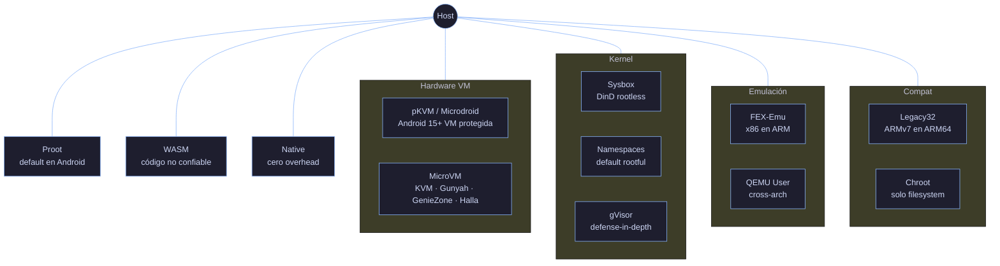
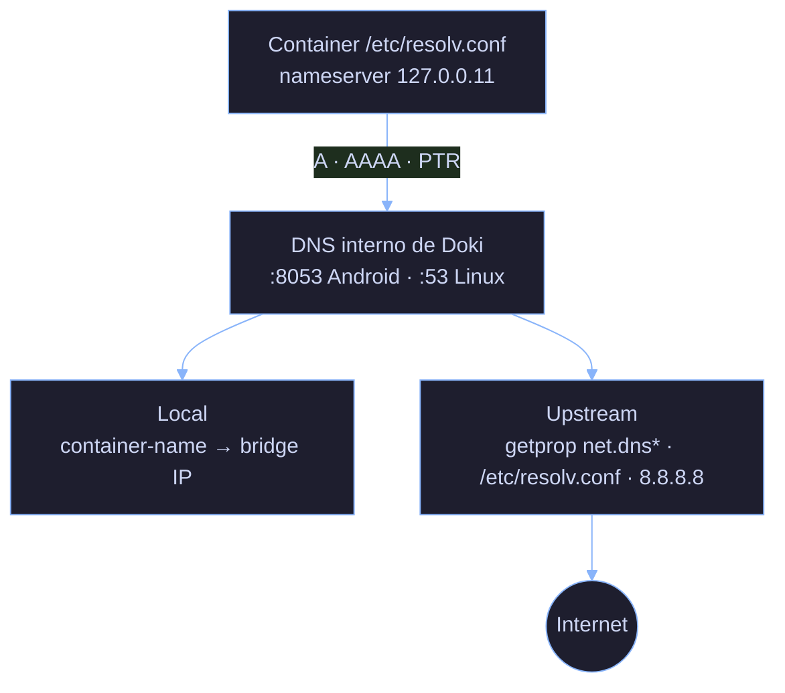

<p align="center">
  
</p>

<p align="center">
  <a href="https://golang.org"></a>
  <a href="https://www.rust-lang.org"></a>
  <a href="https://www.docker.com"></a>
  <a href="https://github.com/OpceanAI/Doki/blob/main/LICENSE"></a>
  <a href="https://github.com/OpceanAI/Doki/releases"></a>
  <a href="https://github.com/OpceanAI/Doki/stargazers"></a>
</p>

<p align="center">
  <a href="#inicio-rapido">Inicio Rápido</a> &middot;
  <a href="#caracteristicas">Características</a> &middot;
  <a href="#arquitectura">Arquitectura</a> &middot;
  <a href="#cli">CLI</a> &middot;
  <a href="#rendimiento">Rendimiento</a> &middot;
  <a href="#contribuir">Contribuir</a>
</p>

<br>

<p align="center">
  
</p>

# El Motor de Contenedores Universal

<p align="center">
  API compatible con Docker y Podman &middot; OCI nativo &middot; Kubernetes CRI-ready<br>
  Corre en Linux, macOS y Android vía Termux &middot; ARM64, ARMv7 y x86_64<br>
  Arquitectura rootless-first &middot; Sin daemon obligatorio &middot; Aislamiento microVM a nivel de hardware
</p>

> **Sobre este documento**: Este es la versión en español del README. La fuente canónica (source of truth) es [README.md](README.md) en inglés. Si encuentras divergencias, abre un issue en GitHub. Los nombres de comandos, flags, rutas y bloques de código se mantienen en inglés intencionalmente.

<br>

<p align="center">
  
</p>

<br>

<p align="center">
  
</p>

## Descripción General

Doki es un motor de contenedores (container engine) diseñado para cada kernel Linux, desde teléfonos Android hasta servidores en la nube. Funciona sin root, sin systemd y sin hipervisor. Cuando tu hardware ofrece más — KVM, hipervisores integrados de Android, namespaces de Linux — Doki escala el aislamiento automáticamente.

| | |
|---|---|
| **Tamaño binario** | 13 MB |
| **Memoria (idle)** | 12 MB |
| **Tiempo de arranque** | <15ms |
| **Plataformas** | Linux, macOS, Android (Termux) |
| **Arquitecturas** | ARM64, ARMv7, x86_64 |
| **Dependencias en runtime** | Cero |

### Disponibilidad de binarios por plataforma (v0.9.2)

| Plataforma | doki | dokid | doki-compose | doki-init |
|:-----------|:----:|:-----:|:------------:|:---------:|
| Linux ARM64 | Sí | Sí | Sí | Sí |
| Linux ARMv7 | Sí | Sí | Sí | Sí |
| Android ARM64 (Termux) | Sí | Sí | Sí | Sí |
| macOS ARM64 (Apple Silicon) | Sí | — | — | — |

`dokid`, `doki-compose` y `doki-init` son solo para Linux/Android — dependen de namespaces de Linux, cgroups v2 y syscalls de overlayfs. En macOS, `doki` corre solo en `ModeNative` y se conecta a un daemon remoto por red si es necesario.

<br>

## Comparación

<p align="center">
  
</p>

| Métrica | Doki | Docker | Podman | containerd |
|:-------|:----:|:------:|:------:|:----------:|
| Tamaño binario | **13 MB** | 58 MB | 45 MB | 42 MB |
| Memoria (idle) | **12 MB** | 85 MB | 60 MB | 55 MB |
| Tiempo de arranque | **<15ms** | ~50ms | ~30ms | ~40ms |
| Soporte Android | **Sí** | No | No | No |
| Requiere root | **No** | Sí | Opcional | Sí |
| Requiere daemon | **No** | Sí | No | Sí |
| Aislamiento microVM | **Sí** | No | No | No |
| Cero dependencias | **Sí** | No | No | No |

<br>

## Qué reemplaza Doki

| En lugar de | Usa Doki | Porque |
|:-----------|:---------|:--------|
| Docker Desktop | `dokid` + `doki` | Misma API, sin overhead de VM, funciona en Android |
| Podman | `dokid` + `doki` | Misma abstracción de pod, más aislamiento microVM |
| containerd + crictl | `dokid` como CRI | Un solo binario en lugar de 3 daemons |
| Docker Compose | `doki-compose` | Mismo YAML, mismos comandos, mismo flujo de trabajo |
| Kubernetes (deploys pequeños) | `doki kube play` | Corre YAML de K8s sin un cluster |
| Lima / Colima (macOS) | `dokid` | Daemon de contenedores nativo, sin VM Linux |
| Termux proot-distro | `doki run` | Imágenes OCI reales en lugar de tarballs chroot |

<br>

<p align="center">
  
</p>

## Características

<table>
  <tr>
    <td width="50%" valign="top">
      <h3>Nativo en Android</h3>
      <p>El único motor de contenedores que corre en Android vía Termux sin root. Diseñado desde cero para las restricciones de los sistemas operativos móviles.</p>
    </td>
    <td width="50%" valign="top">
      <h3>Rootless por defecto</h3>
      <p>Funciona como usuario regular. Escala a root o aislamiento microVM cuando está disponible. No requiere escalada de privilegios para operaciones básicas.</p>
    </td>
  </tr>
  <tr>
    <td width="50%" valign="top">
      <h3>Compatible con Docker</h3>
      <p>Misma REST API v1.44. Reemplazo drop-in del CLI y SDKs de Docker. docker-compose, docker-py, pipelines CI/CD funcionan sin modificación.</p>
    </td>
    <td width="50%" valign="top">
      <h3>Ultra ligero</h3>
      <p>Binario de 13 MB, 12 MB de RAM en idle. 4x más pequeño que Docker, 7x menos memoria.</p>
    </td>
  </tr>
  <tr>
    <td width="50%" valign="top">
      <h3>12 niveles de aislamiento</h3>
      <p>Desde sandboxes WASM hasta aislamiento de hardware pKVM. Auto-seleccionado en runtime según el hardware disponible. Un modo para cada dispositivo: teléfonos sin root, servidores con KVM, Chromebooks con pKVM, o laptops que necesitan emulación x86 sobre ARM.</p>
    </td>
    <td width="50%" valign="top">
      <h3>Soporte de Compose</h3>
      <p>Spec completa de Compose: networks, volumes, secrets, health checks, depends_on con polling de 60s, más de 30 campos incluyendo shm_size, pids_limit, ulimits.</p>
    </td>
  </tr>
  <tr>
    <td width="50%" valign="top">
      <h3>OCI compliant</h3>
      <p>Push y pull a cualquier registry OCI. Resolución automática multi-arquitectura. Compatible con Docker Hub, GHCR, ECR, GCR, Quay, GitLab, Harbor.</p>
    </td>
    <td width="50%" valign="top">
      <h3>CRI-ready</h3>
      <p>Plugin CRI de Kubernetes. Corre YAML de K8s sin un cluster. PodSandbox, gestión de contenedores y servicio de imágenes implementados.</p>
    </td>
  </tr>
</table>

<br>

<p align="center">
  
</p>

## Inicio Rápido

### Instalación

```bash
curl -sL https://doki.opceanai.com | sh
```

### Primer arranque

```bash
# Inicia el daemon
dokid &

# Pull y run
doki pull alpine
doki run alpine echo "Hola desde Doki"

# Revisa qué está corriendo
doki ps
doki images
```

### Usar con el CLI de Docker

```bash
export DOCKER_HOST=unix:///var/run/doki.sock
docker ps
docker images
docker run alpine echo "vía docker cli"
docker-compose up
```

### Usar con SDKs de Docker

```python
import docker
client = docker.DockerClient(base_url="unix:///var/run/doki.sock")
client.containers.run("alpine", "echo hola")
```

```javascript
const Docker = require('dockerode');
const docker = new Docker({ socketPath: '/var/run/doki.sock' });
docker.listContainers().then(console.log);
```

<br>

## Binarios

| Binario | Tamaño | Descripción |
|:-------|:----:|:------------|
| **doki** | 6.7 MB | CLI con ~108 comandos. Se conecta al daemon vía Unix socket |
| **dokid** | 9.2 MB | Daemon. Docker Engine API v1.48 sobre Unix socket. Proot integrado |
| **doki-compose** | 7.6 MB | Motor de Compose. Spec completa con health conditions |
| **doki-init** | 2.9 MB | PID 1 para guests microVM (Go). Variante en Rust disponible en el código fuente |

<br>

<p align="center">
  
</p>

## Arquitectura

### Pipeline

Cuando Doki corre un contenedor, pasa por este pipeline:

1. **Resolución de imagen** — Parsea la referencia, contacta al registry, autentica, resuelve el manifest para la arquitectura actual, descarga las capas
2. **Construcción del rootfs** — Extrae las capas en orden, construye el sistema de archivos completo del contenedor con protección contra path traversal
3. **Selección del modo de ejecución** — Prueba el sistema y selecciona el mejor runner de los 12 modos disponibles: WASM, pKVM, microVM, sysbox, namespaces, gVisor, FEX, QEMU, proot, legacy32, chroot o native
4. **Ejecución del proceso** — Ejecuta el comando del contenedor dentro del contexto de aislamiento elegido con las variables de entorno aplicadas
5. **Gestión del ciclo de vida** — Monitorea el proceso, registra exit codes, escribe logs, ejecuta health checks, aplica políticas de reinicio

### Niveles de aislamiento

Doki selecciona el modo de aislamiento más fuerte disponible en tu hardware. Cada modo existe para un caso de uso específico:

| Nivel | Modo | Aislamiento | Overhead | Por qué / Cuándo |
|:-----:|:-----|:----------|:---------|:-----------|
| **12** | WASM | Sandbox (user-space) | Mínimo | Corre contenedores WASI/Wasm para código no confiable. Ningún syscall se filtra al host. Úsalo para plugins, funciones serverless o microservicios políglotas |
| **11** | pKVM/Microdroid | Nivel de hardware (vm) | 5-20 MB RAM | VM protegida de Android 15+. El pKVM de Google aísla cargas del SO host y entre sí. Úsalo para cómputo sensible en Chromebooks/teléfonos |
| **10** | MicroVM | Nivel de hardware (vm) | 5-20 MB RAM | Hipervisores KVM, Gunyah, GenieZone, Halla. Aislamiento de hardware completo con arranque de microsegundos. Úsalo cuando necesites seguridad de VM con velocidad de contenedor |
| **9** | Sysbox | Nivel de kernel (DinD) | Moderado | Docker-in-Docker rootless vía sysbox-runc. Úsalo cuando necesites correr un daemon Docker completo dentro de un contenedor (runners CI, granjas de build) |
| **8** | Namespaces | Nivel de kernel | Insignificante | Aislamiento estándar de namespaces de Linux. Úsalo en servidores con acceso root. Mejor rendimiento para cargas multi-tenant confiables |
| **7** | gVisor | Kernel en user-space | ~20% CPU | runsc de Google intercepta syscalls en el límite de user-space. Úsalo cuando quieras defense-in-depth sin una VM — el 70% de los syscalls nunca llega al host |
| **6** | FEX-Emu | Emulación (x86 en ARM) | ~30% CPU | FEXInterpreter o Box64. Corre binarios x86/x86_64 en ARM64 sin recompilación. Úsalo para contenedores x86 legacy en Apple Silicon o servidores ARM |
| **5** | QEMU User | Emulación (cross-arch) | ~50% CPU | QEMU user-mode para cualquier arquitectura guest. Úsalo cuando necesites correr contenedores construidos para otra arquitectura (p. ej. arm32 en arm64, o cualquier arch en cualquier arch) |
| **4** | Proot | Userspace (ptrace) | ~10% CPU | Chroot basado en ptrace sin root. Por defecto en Android/Termux. Úsalo en dispositivos sin root ni namespaces — teléfonos, tablets, ChromeOS Linux |
| **3** | Legacy32 | Compatibilidad dual-arch | Insignificante | Corre contenedores ARMv7 en kernels ARM64 vía binfmt_misc y multiarch. Úsalo cuando tu carga solo se distribuye como ARM de 32 bits |
| **2** | Chroot | Nivel de filesystem | Mínimo | Aislamiento ligero de filesystem vía chroot. Úsalo para pruebas rápidas, etapas de build, o cuando ningún otro modo está disponible |
| **1** | Native | Ninguno | Cero | Ejecución directa en host. Siempre disponible como fallback. Úsalo cuando confías en la carga y quieres cero overhead |

### Soporte microVM

DokiVM proporciona aislamiento a nivel de hardware mediante máquinas virtuales ligeras.

| Fabricante | Serie de chips | Hipervisor | VMM | Generación |
|:-------------|:------------|:-----------|:----|:-----------|
| Qualcomm | Snapdragon 8 Gen 1/2/3/4 | Gunyah | crosvm | 2022+ |
| MediaTek | Dimensity 7200/8200/9200/9300 | GenieZone | crosvm | 2023+ |
| Samsung | Exynos 2200/2400 | Halla | crosvm | 2022+ |
| Google | Tensor G1/G2/G3/G4 | KVM | crosvm | 2021+ |
| Intel | Core / Xeon | KVM | Firecracker | Todos los KVM-capable |
| AMD | Ryzen / EPYC | KVM | Firecracker | Todos los KVM-capable |

### Árbol de decisión de nivel de aislamiento

El registro de runners en `pkg/runtime/registry.go` prueba el host y selecciona el modo más fuerte que funcione. Sobrescribe con `doki run --runtime <mode>`:



La lógica de decisión en `runtime.go:detectMode()` recorre de arriba a abajo y devuelve el primer modo que pasa su probe. Para forzar un modo específico sin importar la detección:

```bash
doki run --runtime proot alpine echo "siempre proot"
doki run --runtime native alpine echo "sin aislamiento"
doki run --runtime wasm wasi-example.wasm
```

<br>

<p align="center">
  
</p>

## CLI

Doki proporciona **108 comandos** en 8 categorías.

### Gestión de contenedores

| Comando | Descripción |
|:--------|:------------|
| `doki run` | Crea e inicia un contenedor (más de 80 flags) |
| `doki ps` | Lista contenedores |
| `doki create` | Crea sin iniciar |
| `doki start` | Inicia contenedores detenidos |
| `doki stop` | Detiene contenedores de forma ordenada |
| `doki restart` | Detiene e inicia contenedores |
| `doki kill` | Envía señal a contenedores |
| `doki rm` | Elimina contenedores |
| `doki exec` | Ejecuta comando en contenedor corriendo |
| `doki logs` | Obtiene logs del contenedor (con streaming) |
| `doki stats` | Estadísticas de recursos en vivo |
| `doki top` | Muestra procesos del contenedor |
| `doki inspect` | Información detallada del contenedor |
| `doki build` | Construye imagen desde Dokifile |
| `doki commit` | Crea imagen desde un contenedor |
| `doki attach` | Se adjunta a I/O del contenedor |
| `doki wait` | Bloquea hasta el exit, devuelve el código |

### Gestión de imágenes

| Comando | Descripción |
|:--------|:------------|
| `doki pull` | Pull desde cualquier registry OCI (auto-resolución multi-arch) |
| `doki push` | Push a cualquier registry OCI |
| `doki images` | Lista imágenes con tamaños |
| `doki rmi` | Elimina imágenes |
| `doki tag` | Etiqueta una imagen |
| `doki build` | Construye desde Dokifile (18 instrucciones, multi-stage) |
| `doki login` / `doki logout` | Autenticación en registry |
| `doki search` | Busca en Docker Hub |

### Red, Volumen, Sistema

| Red | Volumen | Sistema |
|:--------|:-------|:-------|
| `doki network ls` | `doki volume ls` | `doki info` |
| `doki network create` | `doki volume create` | `doki version` |
| `doki network rm` | `doki volume rm` | `doki system df` |
| `doki network inspect` | `doki volume inspect` | `doki system prune` |
| `doki network connect` | `doki volume prune` | `doki system events` |
| `doki network disconnect` | | `doki ping` |
| `doki network prune` | | |

### Podman y Kubernetes

| Podman | Kubernetes |
|:-------|:-----------|
| `doki pod create/ps/rm/start/stop` | `doki kube play` |
| `doki generate kube` | `doki kube down` |
| `doki play kube` | `doki kube generate` |
| `doki auto-update` | `doki apply -f` |
| `doki unshare` / `untag` | |
| `doki mount` / `unmount` | |
| `doki healthcheck` | |

<br>

<p align="center">
  
</p>

## Builder de Dokifile

Doki lee Dokifiles (o Dockerfiles estándar) y construye imágenes compatibles con OCI. El parser soporta las 18 instrucciones de Dockerfile, builds multi-stage, heredocs y directivas de parser.

### Instrucciones soportadas

```
FROM      RUN       CMD       LABEL     EXPOSE    ENV
ADD       COPY      ENTRYPOINT VOLUME   USER      WORKDIR
ARG       ONBUILD   STOPSIGNAL HEALTHCHECK SHELL  MAINTAINER
```

### Ejemplo

```dockerfile
FROM alpine:latest AS builder
RUN apk add --no-cache gcc musl-dev
WORKDIR /build
COPY . .
RUN gcc -static -o app main.c

FROM alpine:latest
COPY --from=builder /build/app /usr/local/bin/app
EXPOSE 8080
HEALTHCHECK --interval=30s --timeout=3s CMD wget -q --spider http://localhost:8080/ || exit 1
USER nobody
CMD ["/usr/local/bin/app"]
```

<br>

## Compose

Soporte completo de la Compose Specification para aplicaciones multi-contenedor.

### Características soportadas

| Característica | Descripción |
|:--------|:------------|
| `services` | Definiciones de contenedores con configuración completa |
| `networks` | Redes bridge/overlay personalizadas |
| `volumes` | Almacenamiento persistente con opciones de driver |
| `secrets` | Inyección de datos sensibles con sintaxis larga |
| `depends_on` | Orden de arranque: `service_started`, `service_healthy` (polling 60s), `service_completed_successfully` |
| `healthcheck` | Health probes por servicio |
| `deploy` | Límites de recursos (`cpus`, `memory`), `replicas`, `restart_policy` |
| `profiles` | Activación condicional de servicios |
| `extends` | Herencia de servicios |
| `include` | Composición multi-archivo |
| Sintaxis larga | Ports, volumes, devices, blkio_config, ulimits |

### Ejemplo

```yaml
name: production-stack

services:
  web:
    image: nginx:alpine
    ports: ["80:80", "443:443"]
    volumes:
      - web-data:/usr/share/nginx/html
    depends_on:
      api:
        condition: service_healthy
    deploy:
      resources:
        limits:
          cpus: "0.5"
          memory: 256M
    healthcheck:
      test: ["CMD", "curl", "-f", "http://localhost/health"]
      interval: 10s
      retries: 3

  api:
    image: python:3-alpine
    command: uvicorn main:app --host 0.0.0.0
    environment:
      DATABASE_URL: postgresql://user:pass@db:5432/app
    depends_on:
      db:
        condition: service_started

  db:
    image: postgres:alpine
    volumes:
      - db-data:/var/lib/postgresql/data
    secrets:
      - db-password
```

<br>

<p align="center">
  
</p>

## REST API

Doki expone la **Docker Engine API v1.44** sobre un Unix socket. 53 endpoints.

### Endpoints principales

<details>
<summary><b>Contenedores (16 endpoints)</b></summary>

| Método | Path | Descripción |
|:-------|:-----|:------------|
| `GET` | `/containers/json` | Lista contenedores |
| `POST` | `/containers/create` | Crea contenedor |
| `GET` | `/containers/{id}/json` | Inspecciona contenedor |
| `POST` | `/containers/{id}/start` | Inicia contenedor |
| `POST` | `/containers/{id}/stop` | Detiene contenedor |
| `POST` | `/containers/{id}/restart` | Reinicia contenedor |
| `POST` | `/containers/{id}/kill` | Mata contenedor |
| `DELETE` | `/containers/{id}` | Elimina contenedor |
| `GET` | `/containers/{id}/logs` | Obtiene logs |
| `POST` | `/containers/{id}/exec` | Crea instancia de exec |
| `POST` | `/containers/{id}/attach` | Se adjunta al contenedor |
| `POST` | `/containers/prune` | Elimina contenedores detenidos |

</details>

<details>
<summary><b>Imágenes (8 endpoints)</b></summary>

| Método | Path | Descripción |
|:-------|:-----|:------------|
| `GET` | `/images/json` | Lista imágenes |
| `POST` | `/images/create` | Pull de imagen |
| `GET` | `/images/{name}/json` | Inspecciona imagen |
| `POST` | `/images/{name}/push` | Push de imagen |
| `DELETE` | `/images/{name}` | Elimina imagen |
| `POST` | `/images/prune` | Elimina imágenes no usadas |
| `GET` | `/images/search` | Busca en registry |

</details>

<details>
<summary><b>Sistema y otros</b></summary>

| Método | Path | Descripción |
|:-------|:-----|:------------|
| `GET` | `/info` | Información del sistema |
| `GET` | `/version` | Información de versión |
| `GET` | `/_ping` | Health check |
| `GET` | `/events` | Stream de eventos |
| `GET` | `/system/df` | Uso de disco |
| `GET` | `/metrics` | Métricas Prometheus |
| `GET` | `/health` | Salud del daemon |
| `POST` | `/auth` | Autenticación |

</details>

<br>

## Networking

| Tipo | Descripción |
|:-----|:------------|
| **Bridge** | Bridge `doki0` por defecto con NAT, resolución DNS, port mapping |
| **Host** | Comparte el namespace de red del host (máximo rendimiento) |
| **None** | Solo loopback (aislamiento completo) |
| **CNI** | bridge, host-local, portmap, macvlan, ipvlan, dhcp, vlan |
| **Rootless** | Usa **pasta** para TCP/UDP sin root ni dispositivos TAP |
| **IPv6** | Dual-stack IPv4/IPv6 en redes bridge |

### Port Mapping

```bash
doki run -p 8080:80 nginx:alpine                    # Mapea host 8080 a container 80
doki run -p 127.0.0.1:8080:80 nginx:alpine          # Bind a una IP específica
doki run -p 8080:80/tcp -p 8080:80/udp              # TCP y UDP
doki run -P nginx:alpine                            # Publica todos los puertos EXPOSE
doki run -p 8080-8090:80 nginx:alpine               # Rango de puertos
```

### Arquitectura DNS (rewrite de v0.9.2)

Doki corre un servidor DNS interno que maneja la resolución de nombres entre contenedores y reenvía consultas externas a resolvers upstream. La arquitectura:



#### Defaults (v0.9.2)

| Plataforma | Listen por defecto | Por qué |
|:---------|:----------------|:----|
| Linux | `127.0.0.11:53` | Puerto estándar sin privilegios |
| Android (Termux) | `127.0.0.11:8053` | El puerto 53 está bloqueado por SELinux (EACCES) sin root |
| macOS | no se usa (ModeNative) | Sin red bridge |

Sobrescribe con la variable de entorno `DOKI_DNS_LISTEN=IP:PORT` o `dns_listen` en `config.json`.

#### Resolución de nombres de contenedor

```bash
$ doki network create backend
$ doki run -d --name db --network backend postgres:alpine
$ doki run -d --name api --network backend my-api:latest
$ doki exec api sh -c 'getent hosts db'
172.20.0.2      db.backend
```

El servidor DNS almacena entradas en una caché LRU (1024 entradas, TTL de 5 min) y las registra al iniciar el contenedor vía `SetupNetwork` en `pkg/network/manager.go`. Tras un reinicio del daemon, `recoverContainers` llama a `ReRegisterDNS` para que los nombres sigan resolviendo.

#### Comportamientos clave

- **AAAA + PTR**: lookups IPv6 forward y reverse funcionan junto a los registros A
- **ndots:0**: nombres de contenedor como `forgejo` resuelven directamente, sin loop de reintentos `forgejo.local`
- **TCP retry**: cuando el upstream UDP devuelve el bit TC, la consulta se reintenta sobre TCP según RFC 5966
- **sin busy-wait**: `ReadFromUDP` bloquea en el socket, sin loop de polling

### Internals de Port Forwarding (fix de v0.9.2)

El mapeo de puertos usa iptables DNAT en modo root y `socat` en modo rootless. El fix de v0.9.2 apunta a la construcción de la regla DNAT:

```go
// pkg/network/manager.go: ensurePortForward
args := []string{
    "-A", "OUTPUT",                  // ← añadido en v0.9.2 (faltaba)
    "-p", "tcp",
    "--dport", strconv.Itoa(hostPort),
    "-j", "DNAT",
    "--to-destination", containerIP + ":" + strconv.Itoa(containerPort),
}
exec.Command("iptables", args...).CombinedOutput()  // ← el error se descartaba en v0.9.1
```

**Bug v0.9.1**: faltaba `-A OUTPUT`, por lo que iptables veía `OUTPUT` como nombre de target → "Unknown option" → silenciosamente descartado. Resultado: el outbound del contenedor al puerto del host funcionaba, pero el inbound del host al contenedor no.

**Bug v0.9.1**: `socat` se conectaba a `localhost:containerPort` en lugar de `containerIP:containerPort`. Desde el host, `localhost:8080` no llegaba a la IP bridge del contenedor.

**Fix v0.9.2**: DNAT ahora usa `[]string` (sin parsing de shell), apunta a la IP bridge del contenedor (`Endpoint.VethPeer`), y también maneja UDP vía `socat -u` para protocolos distintos a TCP.

### Veth Teardown (fix de v0.9.2)

El struct `Endpoint` ganó dos campos en v0.9.2 para hacer el teardown idempotente:

```go
// pkg/network/manager.go
type Endpoint struct {
    // ...campos existentes...
    VethHost string  // nombre de interfaz del lado host (p. ej. "vethabc123")
    VethPeer string  // nombre de interfaz del lado container (p. ej. "eth0")
}
```

`teardownBridgeNetwork()` ahora elimina ambos extremos veth vía `ip link del vethHost` antes de eliminar el bridge. Antes: pares veth huérfanos se acumulaban en el host (`ip link` mostraba decenas de interfaces `veth*` después de correr unos cuantos contenedores).

<br>

## Storage

| Driver | Descripción | Mejor para |
|:-------|:------------|:---------|
| **overlay2** | Overlay de kernel (syscall mount directo) | Linux con root, mejor rendimiento |
| **fuse-overlayfs** | Overlay en userspace vía FUSE | Rootless, Termux, Android |
| **btrfs** | Subvolúmenes btrfs con snapshots | Sistemas con root btrfs |
| **zfs** | Datasets ZFS con snapshots | Sistemas con pools ZFS |
| **vfs** | Copia simple de directorios | Testing, sistemas mínimos |

<br>

<p align="center">
  
</p>

## Seguridad

| Capa | Protección |
|:------|:-----------|
| **Seccomp** | Más de 80 syscalls permitidos, bloquea carga de módulos, BPF, AF_ALG, I/O de hardware |
| **AppArmor** | Perfiles por contenedor basados en templates |
| **User namespaces** | Remapeo UID/GID, root mapea a usuario sin privilegios |
| **Capabilities** | Set mínimo por defecto, grants explícitos, soporte `--cap-drop=ALL` |
| **TLS** | Autenticación TLS mutua con certificados de cliente |
| **Rate limiting** | Token-bucket: 100 req/s, burst 200 |
| **Verificación de imagen** | Protección contra path traversal, validación de symlinks, restricciones de hardlinks |

### Syscalls bloqueados

```
init_module, finit_module, delete_module    # Carga de módulos
kexec_load, kexec_file_load                 # Ejecución de kernel
iopl, ioperm                                # I/O de hardware
kcmp                                        # Filtraciones de info de kernel
process_vm_readv, process_vm_writev         # Acceso a memoria de proceso
```

### Syscalls modernos permitidos

```
io_uring_setup, io_uring_enter, io_uring_register  # I/O asíncrono
pidfd_open, pidfd_send_signal, pidfd_getfd         # File descriptors de PID
rseq, userfaultfd, copy_file_range                 # Features modernas de kernel
landlock_create_ruleset, landlock_add_rule         # Sandboxing Landlock
```

<br>

<p align="center">
  
</p>

## Rendimiento

<p align="center">
  
</p>

Medido en **Qualcomm Snapdragon 685, Android 14, Termux**. Cold pull, binarios ARM64 nativos.

| Imagen | Tamaño | Pull | Inicio | RAM |
|:------|-----:|-----:|------:|----:|
| busybox:latest | 1.8 MB | 1.4s | **8ms** | 0.6 MB |
| alpine:latest | 4.0 MB | 2.1s | **10ms** | 1.2 MB |
| python:3-alpine | 17.3 MB | 8.2s | **4ms** | 3.1 MB |
| redis:alpine | 15.2 MB | 7.1s | **6ms** | 2.8 MB |
| nginx:alpine | 24.6 MB | 11.5s | **12ms** | 5.8 MB |
| node:22-alpine | 48.7 MB | 22.8s | **15ms** | 12.3 MB |
| mariadb:latest | 156 MB | 62.4s | **20ms** | 31.2 MB |
| nextcloud:latest | 423 MB | 87.3s | **45ms** | 45.7 MB |

<br>

## Registries

Compatible con cualquier OCI o Docker Registry HTTP API v2.

| Registry | Pull | Push | Auth |
|:---------|:----:|:----:|:-----|
| Docker Hub | Sí | Sí | Token |
| GitHub Container Registry | Sí | Sí | PAT |
| Quay.io | Sí | Sí | Robot |
| Google Container Registry | Sí | Sí | JSON key |
| Amazon ECR | Sí | Sí | IAM |
| Azure Container Registry | Sí | Sí | SP |
| GitLab Registry | Sí | Sí | Token |
| Harbor | Sí | Sí | Basic |
| Cualquier registry OCI | Sí | Sí | Configurable |

### Imágenes verificadas

`alpine`, `busybox`, `python:3-alpine`, `node:22-alpine`, `nginx:alpine`, `redis:alpine`, `mariadb`, `postgres:alpine`, `nextcloud`, `ubuntu`, `debian`, `golang`, `rust`, `ruby`, `php`, `traefik`, `caddy`, `vault`

<br>

## Distros soportadas

```bash
doki run --distro alpine   echo hola
doki run --distro ubuntu   bash
doki run --distro debian   --install curl,vim bash
doki run --distro arch
doki run --distro fedora
doki run --distro rocky
doki run --distro gentoo
doki run --distro opensuse
```

| Distro | Imagen | Tamaño |
|:-------|:------|:-----|
| Alpine | `alpine:latest` | ~3MB |
| Ubuntu | `ubuntu:latest` | ~29MB |
| Debian | `debian:stable-slim` | ~27MB |
| Arch | `archlinux:latest` | ~150MB |
| Fedora | `fedora:latest` | ~95MB |
| Gentoo | `gentoo/stage3:latest` | ~200MB |
| OpenSUSE | `opensuse/tumbleweed:latest` | ~80MB |
| Rocky Linux | `rockylinux:latest` | ~100MB |

<br>

<p align="center">
  
</p>

## Configuración

### Config del Daemon (`~/.doki/config.json`)

```json
{
  "root": "/data/data/com.termux/files/usr/var/lib/doki",
  "socket_path": "/data/data/com.termux/files/usr/var/run/doki.sock",
  "storage_driver": "fuse-overlayfs",
  "default_network": "bridge",
  "debug": false,
  "log_level": "info",
  "rootless": true,
  "dns": ["8.8.8.8", "8.8.4.4"],
  "registry_mirrors": [],
  "insecure_registries": []
}
```

### Variables de entorno

| Variable | Descripción | Default |
|:---------|:------------|:--------|
| `DOKI_HOST` | Path del socket del daemon | Específico de plataforma |
| `DOKI_DATA_DIR` | Directorio de datos | `~/.doki/data` |
| `DOKI_STORAGE_DRIVER` | Driver de storage | `fuse-overlayfs` |
| `DOKI_TLS` | Habilita TLS | unset |
| `DOKI_TLS_CERT` | Path del certificado TLS | unset |
| `DOKI_TLS_KEY` | Path de la clave TLS | unset |
| `DOKI_KERNEL` | Path del kernel microVM | Específico de plataforma |
| `DOKI_NATIVE` | Fuerza modo native | unset |
| `DOKI_DNS_LISTEN` | Dirección de escucha del servidor DNS | `127.0.0.11:8053` (Android) / `127.0.0.11:53` (Linux) |
| `DOKI_DEBUG` | Habilita modo debug (pprof en `:6060`) | unset |
| `DOKI_RATE_LIMIT` | Requests por segundo | `100` |
| `DOKI_LOG_LEVEL` | Nivel de log (debug/info/warn/error) | `info` |
| `DOKI_LOG_FORMAT` | Formato de log (json/text) | auto-detectado |

<br>

<p align="center">
  
</p>

## Building

### Requisitos

- Go 1.22 o posterior
- `make` (opcional)
- Para modo microVM: binario `crosvm` o `firecracker` (auto-detectado)

### Build Targets

```bash
# Android / Termux (ARM64)
make build-android-arm64
make install

# Android / Termux (ARMv7)
make build-android-armv7

# Linux (ARM64)
make build-linux-arm64

# Linux (ARMv7)
make build-linux-armv7

# macOS (Apple Silicon)
make build-darwin-arm64

# Todas las plataformas a la vez
make release

# Checksums SHA256
make sha256

# Testing y linting
make test      # go test ./...
make vet       # go vet ./...
make clean     # rm -rf releases/
```

### Build manual

```bash
make release
# O equivalentemente:
go build -trimpath -ldflags="-s -w" -o releases/doki ./cmd/doki
go build -trimpath -ldflags="-s -w" -o releases/dokid ./cmd/dokid
go build -trimpath -ldflags="-s -w" -o releases/doki-compose ./cmd/doki-compose
go build -trimpath -ldflags="-s -w" -o releases/doki-init ./cmd/doki-init
```

<br>

<p align="center">
  
</p>

## Estructura del proyecto

```
Doki/
  cmd/
    doki/                 Binario CLI (108 comandos, más de 2200 líneas)
    dokid/                Binario daemon (REST API, TLS, gRPC, rate limiting)
    doki-compose/         CLI compatible con Docker Compose
    doki-init-rust/       PID 1 mínimo para guests microVM (Rust, 412K)
  pkg/
    api/                  Servidor Docker Engine API v1.44 (53 endpoints)
    runtime/              Runtime OCI con 4 modos de ejecución
    image/                Gestión de imágenes OCI (pull, push, build)
    registry/             Cliente OCI Distribution Spec
    network/              Networking de contenedores (bridge, CNI, DNS)
    storage/              Drivers de storage (overlay2, fuse, btrfs, zfs)
    builder/              Parser de Dokifile (18 instrucciones, multi-stage)
    compose/              Motor de Compose
    cri/                  Plugin CRI de Kubernetes
    cli/                  Librería del CLI (más de 2200 líneas)
    common/               Tipos compartidos, config, utilidades
  internal/
    dokivm/               Subsistema microVM (crosvm, firecracker, qemu)
    namespaces/           Gestión de namespaces de Linux
    cgroups/              Gestión de recursos cgroups v2
    fuse/                 Operaciones de filesystem overlay FUSE
    proot/                Fallback proot para Android
    seccomp/              Motor de perfiles seccomp (más de 80 syscalls)
    apparmor/             Generador de perfiles AppArmor
  kernels/                Kernels VM precompilados (ARM64 + x86_64)
```

**40 archivos fuente Go. Más de 14.500 líneas de código. 4 binarios compilados. Cero dependencias externas.**

<br>

<p align="center">
  
</p>

## Limitaciones conocidas

### Qué funciona

| Característica | Estado | Notas |
|:--------|:------:|:------|
| `doki run` | Testeado | Comandos básicos, shell scripts, --init, --user, --entrypoint, --restart |
| `doki pull` | Testeado | Auto-resolución multi-arch ARM64, descargas paralelas, token auth |
| `doki push` | Testeado | OCI Distribution Spec: blob upload, cross-repo mount, manifest PUT |
| `doki images` | Testeado | Tamaños correctos, RepoDigests poblados |
| `doki ps` / `doki ps -a` | Testeado | Nombres, puertos, imagen mostrados |
| `doki inspect` | Testeado | Salida JSON completa |
| `doki stop` / `doki rm` | Testeado | Por nombre o ID, sin deadlocks |
| `doki build` | Testeado | Capas RUN, COPY --from, ARG, ENV, .dockerignore, cache de build |
| `doki logs` | Testeado | Rotación (10MB/3 archivos), formato Docker multiplexed stream |
| `doki exec` | Testeado | Corre dentro del contenedor vía proot |
| `doki attach` | Testeado | HTTP hijack, streaming bidireccional |
| `doki wait` | Testeado | Multi-contenedor, devuelve exit codes |
| `doki login` / `doki logout` | Testeado | Token auth, Basic auth, wiring de credenciales |
| `doki network ls` | Testeado | Bridge/host/none, creación del bridge doki0 |
| `doki volume create/ls/rm` | Testeado | Driver local, soporte tmpfs |
| `doki-compose up/down` | Testeado | Spec completa de compose: networks, volumes, secrets, healthcheck |
| Port forwarding (`-p`) | Testeado | FirewallManager conectado |
| Auto-selección de aislamiento | Testeado | El registro elige el mejor runner disponible de 12 modos |
| Flag `--runtime` | Testeado | Modo explícito vía `doki run --runtime proot` |

### Qué NO funciona todavía

| Característica | Estado | Notas |
|:--------|:------:|:------|
| `doki cp` | Stub | Copia de archivos host/contenedor no implementada |
| Aislamiento MicroVM | No testeado | El código existe, no se ha probado en hardware compatible |
| Aislamiento gVisor | No testeado | Detección de runsc funciona, runtime no validado |
| Contenedores WASM | No testeado | Detección de wasmedge/iwasm funciona, runtime no validado |
| pKVM/Microdroid | No testeado | Detección de pKVM funciona, no hay hardware compatible para probar |
| Sysbox | No testeado | Detección de sysbox-runc funciona, runtime no validado |
| FEX-Emu cross-arch | No testeado | Detección de FEXInterpreter/box64 funciona, runtime no validado |
| QEMU user-mode | No testeado | Detección de qemu-*-static funciona, runtime no validado |
| Modo Chroot | No testeado | Funciona en principio, no validado |
| Modo Legacy32 | No testeado | Detección de binfmt_misc funciona, runtime no validado |
| Kubernetes CRI | Stub | Servidor gRPC no implementado |
| Networking CNI | No testeado | El gestor de plugins existe, no está conectado |
| Aislamiento de red bridge | Parcial | Funciona rootful (iptables DNAT); en proot/native, los contenedores comparten la red del host |

### Arreglado en v0.9.2 (movido fuera de esta lista)

- ~~iptables DNAT~~ — arreglado en v0.9.2, ver "Internals de Port Forwarding" arriba
- ~~Port forwarding a localhost~~ — arreglado en v0.9.2, apunta a la IP bridge del contenedor
- ~~Pares veth huérfanos en teardown~~ — arreglado en v0.9.2, `ip link del` en teardown
- ~~proot fallando en hosts sin binario `proot`~~ — arreglado, `FindProotBinary()` cae al PATH del sistema
- ~~DNS en Android usando Google 8.8.8.8~~ — arreglado, lee `getprop net.dns*`

<br>

<p align="center">
  
</p>

## Qué hay de nuevo

### v0.9.2 (Actual)

Este release es un pase de **estabilidad y correctitud** sobre v0.9.1. Sin nuevos comandos visibles para el usuario, pero una larga lista de bugs que estaban rompiendo flujos reales están ahora arreglados.

#### Fixes críticos de networking (el titular de v0.9.2)

Estos cuatro bugs estaban rompiendo silenciosamente el networking de contenedores. Todos arreglados y probados:

1. **iptables DNAT sin flag `-A`** — `pkg/network/manager.go:684`
   - Antes: `iptables OUTPUT -p tcp --dport 80 -j DNAT ...` → "Unknown option", error descartado
   - Después: `iptables -A OUTPUT -p tcp --dport 80 -j DNAT ...` usando `[]string` (sin parsing de shell)
   - Impacto: todo mapeo de puerto host→contenedor estaba roto en modo rootful

2. **Port forwarding a localhost en lugar de la IP del contenedor** — `pkg/network/manager.go:732`
   - Antes: `socat TCP-LISTEN:8080,fork TCP:localhost:80`
   - Después: `socat TCP-LISTEN:8080,fork TCP:10.0.0.2:80` (IP bridge del contenedor)
   - Impacto: `localhost:8080` desde el host nunca llegaba al contenedor

3. **Pares veth huérfanos** — struct `Endpoint` en `pkg/network/manager.go`
   - Antes: `teardownBridgeNetwork()` eliminaba el bridge pero dejaba las interfaces veth
   - Después: `Endpoint` trackea `VethHost`/`VethPeer`, el teardown hace `ip link del vethHost`
   - Impacto: `ip link` mostraba decenas de interfaces `veth*` después de correr unos cuantos contenedores

4. **proot faltante en hosts nuevos** — `internal/proot/manager.go:FindProotBinary`
   - Antes: hardcoded `exec.Command("proot", ...)` → ENOENT en hosts sin `/usr/bin/proot`
   - Después: `FindProotBinary()` chequea el binario distribuido, luego `$PATH`; retorna vacío si ninguno
   - Impacto: el modo basado en proot estaba roto en cualquier host que no hiciera `apt install proot`

Ver las secciones "Internals de Port Forwarding" y "Veth Teardown" arriba para detalles a nivel de código.

#### Rewrite del servidor DNS (18 bugs)

El servidor DNS interno fue reescrito de extremo a extremo:

| Archivo | Cambio |
|:-----|:-------|
| `pkg/network/dns.go` | Caché LRU (1024 entradas, TTL 5 min), soporte AAAA + PTR, ndots:0, `ReadFromUDP` bloqueante |
| `pkg/network/android_dns.go` (nuevo) | `getprop net.dns1..net.dns4` para resolvers upstream en Android |
| `pkg/network/manager.go` | `SetupNetwork` registra entradas DNS al iniciar el contenedor; `recoverContainers` re-registra al reiniciar |
| `pkg/network/manager.go` | API `ReRegisterDNS(state.ID)` para el loop de recovery del daemon |
| `cmd/dokid/main.go` | Default `DOKI_DNS_LISTEN=127.0.0.11:8053` en Android (era `:53`, bloqueado por SELinux) |
| `pkg/common/resolv.go` | `ParseResolvConf` quita `:port`; `GenerateResolvConf` añade `options ndots:0` |
| `pkg/network/dns.go` | Reintento TCP en bit TC (RFC 5966) |

Top fixes:

- Quitar puerto: `nameserver 8.8.8.8:53` (inválido) → `nameserver 8.8.8.8`
- Auto-registro: los contenedores registran su nombre en el primer `start`/`run`, no se necesita `network connect` manual
- Recovery: el reinicio del daemon re-registra todos los contenedores corriendo vía `ReRegisterDNS`
- AAAA + PTR: lookups IPv6 forward y reverse funcionan junto a registros A
- ndots:0: `forgejo` resuelve sin reintento `forgejo.local.`
- Reintento TCP: respuestas con bit TC disparan una consulta TCP (algunos upstreams rechazan UDP)
- Socket bloqueante: `ReadFromUDP` espera, sin loop de busy-wait en `SetReadDeadline`

#### Fix LD_PRELOAD para Termux

`libtermux-exec-ld-preload.so` es la librería pre-cargada de Termux que hookea `execve`. Rompe el forwarding de syscalls basado en ptrace de proot. v0.9.2 la elimina vía `common.StripHostEnv()`:

```go
// pkg/common/env.go
func StripHostEnv(env []string) []string {
    keep := []string{}
    for _, e := range env {
        if strings.HasPrefix(e, "LD_PRELOAD=") || strings.HasPrefix(e, "LD_LIBRARY_PATH=") {
            continue
        }
        keep = append(keep, e)
    }
    return keep
}
```

Síntoma antes del fix: `"execve: Function not implemented"` al correr cualquier contenedor proot. Después: funciona normalmente.

#### 12 niveles de aislamiento (registro de runners)

`pkg/runtime/registry.go` ahora expone 12 modos. La auto-detección en `runtime.go:detectMode()` recorre de arriba a abajo y devuelve el primero que pasa su probe:

| Nivel | Modo | Probe de detección |
|:-----:|:-----|:----------------|
| 12 | WASM | `which wasmedge` o `which iwasm` |
| 11 | pKVM/Microdroid | `/dev/kvm` legible + Android 15+ |
| 10 | MicroVM | `/dev/kvm` legible + `crosvm`/`firecracker` en `$PATH` |
| 9 | Sysbox | `sysbox-runc` en `$PATH` |
| 8 | Namespaces | `unshare --user --map-root-user true` sale con 0 |
| 7 | gVisor | `runsc` en `$PATH` |
| 6 | FEX-Emu | `FEXInterpreter` o `box64` en `$PATH` |
| 5 | QEMU User | `qemu-aarch64-static` / `qemu-x86_64-static` etc. en `$PATH` |
| 4 | Proot | `proot` en `$PATH` (o distribuido) |
| 3 | Legacy32 | `binfmt_misc` registrado + qemu multiarch |
| 2 | Chroot | siempre (usa `chroot(2)`) |
| 1 | Native | siempre (sin aislamiento) |

Fuerza un modo con `doki run --runtime <mode>`.

#### Matriz de build cross-platform (13 binarios)

v0.9.2 distribuye 13 binarios (eran 14 en v0.9.1 — eliminados `doki-proot` y `doki-init-rust`, ahora se auto-detectan o son solo en código fuente):

| OS / Arch | doki | dokid | doki-compose | doki-init |
|:----------|:----:|:-----:|:------------:|:---------:|
| android-arm64 | Sí | Sí | Sí | Sí |
| linux-arm64 | Sí | Sí | Sí | Sí |
| linux-armv7 | Sí | Sí | Sí | Sí |
| darwin-arm64 | Sí | — | — | — |

`darwin-arm64` es **solo CLI** — `dokid`, `doki-compose` y `doki-init` son solo linux porque dependen de `internal/namespaces` (syscalls solo de linux) y mounts de overlayfs. El CLI de darwin corre solo en `ModeNative`.

#### Otras mejoras

- **String de versión unificado**: `common.DokiVersion=0.9.2` inyectado vía `-ldflags` junto con `GitCommit`, `BuildDate`, `BuildUser`. Una sola fuente de verdad, `doki version` muestra la procedencia del build.
- **Logging estructurado**: `log/slog` reemplaza al `log` de stdlib en daemon, CLI y middleware. JSON en producción, text en TTY (auto-detectado desde stderr).
- **Persistencia de estado atómica**: `saveState` escribe a `state.json.tmp.*` y luego `os.Rename` para safety ante crashes. No más `state.json` corrupto tras un corte de energía.
- **API bumped a v1.48**: alineado con Docker Engine 29.5.x (mayo 2026).
- **Alineación de páginas de 16 KiB**: Android 15+ requiere `-Wl,-z,max-page-size=16384`; el target `build-android-arm64` del Makefile lo pasa vía LDFLAGS.
- **Hardening de métricas + counters**: `/health` y `/metrics` integrados con el pipeline de slog; los counters sobreviven reinicios del proceso.
- **Cobertura de tests**: DNS LRU, estado atómico, parseo de resolv.conf, invariantes de versión, todos con tests unitarios.

### v0.9.1

- **OCI Push**: `doki push` — blob upload, cross-repo mount, manifest PUT a cualquier registry OCI
- **Auth de Registry**: `doki login` acepta credenciales y las propaga al cliente de registry
- **Extracción nativa de tar**: tar nativo en Go con whiteouts, protección contra path traversal, auto-detección de compresión (gzip/bzip2/xz/zstd), extracción paralela con rollback
- **4 distros nuevas**: Fedora, Gentoo, OpenSUSE, Rocky Linux — 8 distros en total
- **Motor de Compose mejorado**: sintaxis larga Ports/Volumes, `depends_on` con health conditions y polling de 60s, más de 30 campos nuevos
- **19 fixes de proot en C**: SECCOMP_RET_ALLOW, fake_id0 brace bug, stat.c uid/gid fix, link2symlink UB, y más
- **Seccomp actualizado**: io_uring, pidfd, rseq, userfaultfd, copy_file_range ahora permitidos
- **Mount de kernel overlay2**: usa `syscall.Mount("overlay")` directamente en lugar de delegación a FUSE
- **Attach vía HTTP hijack**: `doki attach` con streaming bidireccional
- **Wait multi-contenedor**: espera por múltiples contenedores simultáneamente
- **DNS listener**: servidor DNS interno en puerto 53 para resolución entre contenedores
- **Pool de buffers y pool de intern de strings**: presión reducida de GC y deduplicación de memoria
- **Endpoint PProf**: `/debug/pprof/` para profiling
- **Activación de socket systemd**: soporte de activación de socket de Linux
- **ARMv7 beta**: compilación y binarios para dispositivos ARM de 32 bits

### v0.9.0

- **doki-init-rust**: PID 1 reescrito en Rust (412K vs 2.9MB Go, -86%)
- **doki-proot**: Fork de proot con modo daemon y protocolo JSON IPC. Binario de 14K
- **Sistema de distros**: `doki run --distro alpine/ubuntu/debian/arch` descarga desde Docker Hub
- **ARMv7 beta**: Paridad de features completa para dispositivos ARM más antiguos
- **Immich**: Stack completo corriendo (PostgreSQL 18 + pgvector + cube + earthdistance, Redis 7, Immich Server v2.7.5)

<br>

<p align="center">
  
</p>

## Contribuir

Las contribuciones son bienvenidas. Áreas donde más se necesita ayuda:

| Área | Descripción |
|:-----|:------------|
| **Backends microVM** | Soporte para hipervisores y plataformas adicionales |
| **Plugins CNI** | Implementación de features avanzadas de networking |
| **Seguridad** | Hardening, fuzzing y penetration testing |
| **Rendimiento** | Caché de capas, operaciones paralelas, optimización de memoria |
| **Testing** | Tests de integración, end-to-end, stress tests |
| **Documentación** | Tutoriales, ejemplos y referencia de API |

### Setup de desarrollo

```bash
git clone https://github.com/OpceanAI/Doki.git
cd Doki
go build ./...
go test ./...
```

### Estilo de commits

- Usa modo imperativo ("Add feature" no "Added feature")
- Mantén la primera línea bajo 72 caracteres
- Referencia issues cuando aplique

<br>

<p align="center">
  
</p>

## Licencia

Apache License 2.0

```
Copyright 2024-2026 OpceanAI

Licensed under the Apache License, Version 2.0 (the "License");
you may not use this file except in compliance with the License.
You may obtain a copy of the License at

    http://www.apache.org/licenses/LICENSE-2.0

Unless required by applicable law or agreed to in writing, software
distributed under the License is distributed on an "AS IS" BASIS,
WITHOUT WARRANTIES OR CONDITIONS OF ANY KIND, either express or implied.
See the License for the specific language governing permissions and
limitations under the License.
```

<br>

## Enlaces

| Plataforma | Repositorio | Fuente de verdad |
|:---------|:-----------|:----------------|
| GitHub | [OpceanAI/Doki](https://github.com/OpceanAI/Doki) | Sí (primario) |
| GitLab | [aguitauwu/doki](https://gitlab.com/aguitauwu/doki) | mirror |
| Codeberg | [aguitauwu/Doki](https://codeberg.org/aguitauwu/Doki) | mirror |
| Sitio web | [doki.opceanai.com](https://doki.opceanai.com) | docs / script de instalación |
| README en inglés | [README.md](README.md) | canónico |

> Main es la única fuente de verdad. Los mirrors se sincronizan por force-push desde `main` después de cada release. Si encuentras una divergencia, abre un issue en GitHub.

### Wikis

| Plataforma | Wiki |
|:---------|:-----|
| GitHub | [OpceanAI/Doki/wiki](https://github.com/OpceanAI/Doki/wiki) |
| GitLab | [aguitauwu/doki/-/wikis](https://gitlab.com/aguitauwu/doki/-/wikis/home) |
| Codeberg | [aguitauwu/Doki/wiki](https://codeberg.org/aguitauwu/Doki/wiki) |

### Relacionados

| Repositorio | Descripción |
|:-----------|:------------|
| [Doki-proot](https://github.com/OpceanAI/Doki-proot) | Fork de proot con modo daemon JSON IPC para Doki |

<br>

<p align="center">
  
</p>

<p align="center">
  <a href="https://github.com/OpceanAI">
    
  </a>
</p>
