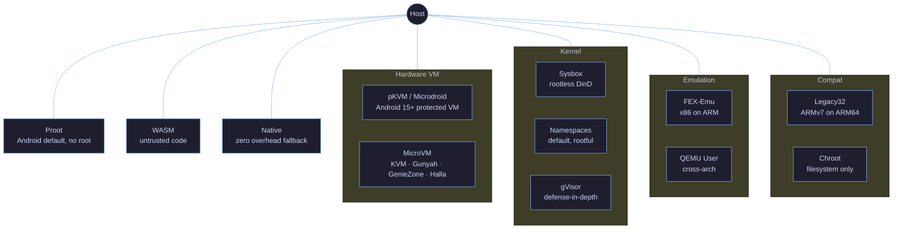
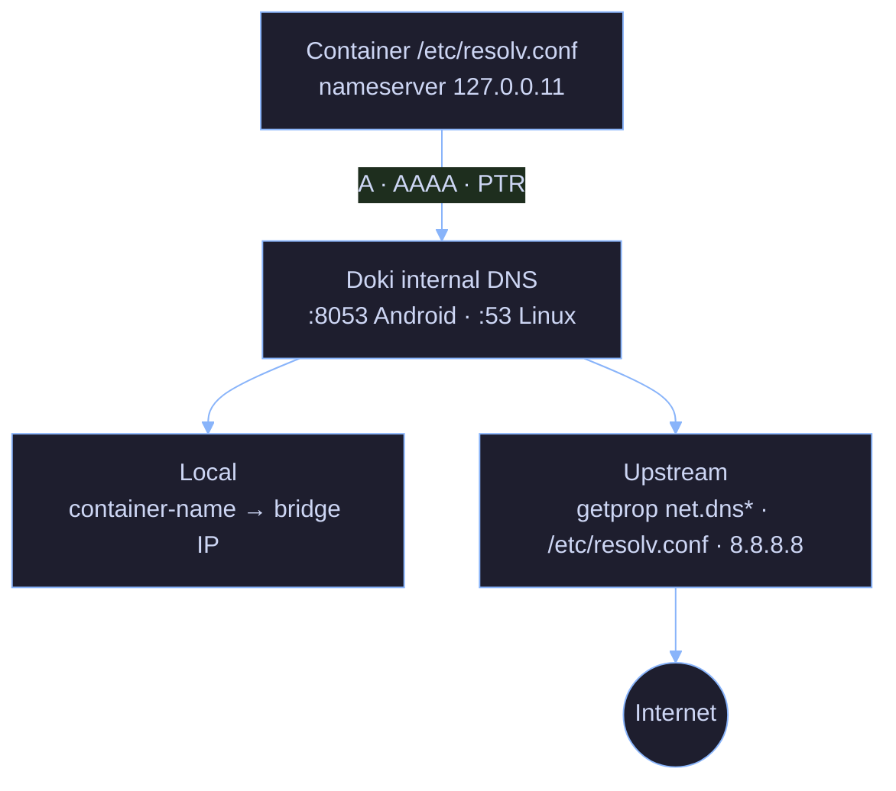

<p align="center">
  
</p>

<p align="center">
  <a href="https://golang.org"></a>
  <a href="https://www.rust-lang.org"></a>
  <a href="https://github.com/OpceanAI/Doki/blob/main/LICENSE"></a>
  <a href="https://github.com/OpceanAI/Doki/releases"></a>
  <a href="https://github.com/OpceanAI/Doki/stargazers"></a>
</p>

<p align="center">
  <a href="#quick-start">Quick Start</a> &middot;
  <a href="#features">Features</a> &middot;
  <a href="#architecture">Architecture</a> &middot;
  <a href="#cli">CLI</a> &middot;
  <a href="#performance">Performance</a> &middot;
  <a href="#contributing">Contributing</a>
</p>

<br>

<p align="center">
  
</p>

# The Universal Container Engine

<p align="center">
  Docker and Podman compatible API &middot; OCI native &middot; Kubernetes CRI-ready<br>
  Runs on Linux, macOS, and Android via Termux &middot; ARM64, ARMv7 & x86_64<br>
  Rootless-first architecture &middot; No daemon required &middot; Hardware-level microVM isolation
</p>

<br>

<p align="center">
  
</p>

<br>

<p align="center">
  
</p>

## Overview

Doki is a container engine designed for every Linux kernel, from Android phones to cloud servers. It works without root, without systemd, and without a hypervisor. When your hardware offers more -- KVM, Android's built-in hypervisors, Linux namespaces -- Doki scales up its isolation automatically.

| | |
|---|---|
| **Binary size** | 13 MB |
| **Memory (idle)** | 12 MB |
| **Start time** | <15ms |
| **Platforms** | Linux, macOS, Android (Termux) |
| **Architectures** | ARM64, ARMv7, x86_64 |
| **Runtime deps** | Zero |

### Binary Availability by Platform (v0.10.0)

| Platform | doki | dokid | doki-compose | doki-init | doki-kube | doki-kubectl |
|:---------|:----:|:-----:|:------------:|:---------:|:---------:|:------------:|
| Linux ARM64 | Yes | Yes | Yes | Yes | Yes | Yes |
| Linux ARMv7 | Yes | Yes | Yes | Yes | Yes | Yes |
| Android ARM64 (Termux) | Yes | Yes | Yes | Yes | Yes | Yes |
| macOS ARM64 (Apple Silicon) | Yes | — | Yes | — | — | — |
| macOS x86_64 (Intel) | Yes | — | — | — | — | — |

**Note:** Android ARMv7 binaries are built with `GOOS=linux` (Go 1.22+ requires external linker for `GOOS=android` on 32-bit ARM). The binaries run via proot; Android detection uses filesystem probes.

`dokid`, `doki-compose`, and `doki-init` are Linux/Android only — they depend on Linux namespaces, cgroups v2, and overlayfs syscalls. On macOS, `doki` runs in `ModeNative` only and connects to a remote daemon over the network if needed.

<br>

## Comparison

<p align="center">
  
</p>

| Metric | Doki | Docker | Podman | containerd |
|:-------|:----:|:------:|:------:|:----------:|
| Binary size | **13 MB** | 58 MB | 45 MB | 42 MB |
| Memory (idle) | **12 MB** | 85 MB | 60 MB | 55 MB |
| Start time | **<15ms** | ~50ms | ~30ms | ~40ms |
| Android support | **Yes** | No | No | No |
| Root required | **No** | Yes | Optional | Yes |
| Daemon required | **No** | Yes | No | Yes |
| microVM isolation | **Yes** | No | No | No |
| Zero dependencies | **Yes** | No | No | No |

<br>

## What Doki Replaces

| Instead of | Use Doki | Because |
|:-----------|:---------|:--------|
| Docker Desktop | `dokid` + `doki` | Same API, no VM overhead, works on Android |
| Podman | `dokid` + `doki` | Same pod abstraction, plus microVM isolation |
| containerd + crictl | `dokid` as CRI | Single binary instead of 3 daemons |
| Docker Compose | `doki-compose` | Same YAML, same commands, same workflow |
| Kubernetes (small deploys) | `doki kube play` | Run K8s YAML without a cluster |
| Lima / Colima (macOS) | `dokid` | Native container daemon, no Linux VM needed |
| Termux proot-distro | `doki run` | Actual OCI images instead of chroot tarballs |

<br>

<p align="center">
  
</p>

## Features

<table>
  <tr>
    <td width="50%" valign="top">
      <h3>Android Native</h3>
      <p>The only container engine that runs on Android via Termux without root. Designed for the constraints of mobile operating systems from the ground up.</p>
    </td>
    <td width="50%" valign="top">
      <h3>Rootless by Default</h3>
      <p>Works as a regular user. Scales to root or microVM isolation when available. No privilege escalation required for basic operations.</p>
    </td>
  </tr>
  <tr>
    <td width="50%" valign="top">
      <h3>Docker Compatible</h3>
      <p>Same REST API v1.54. Drop-in replacement for Docker CLI and SDKs. docker-compose, docker-py, CI/CD pipelines all work without modification.</p>
    </td>
    <td width="50%" valign="top">
      <h3>Ultra Lightweight</h3>
      <p>13MB binary, 12MB RAM idle. 4x smaller than Docker, 7x less memory.</p>
    </td>
  </tr>
  <tr>
    <td width="50%" valign="top">
      <h3>12 Isolation Levels</h3>
      <p>From WASM sandboxes to pKVM hardware isolation. Auto-selected at runtime based on available hardware. A mode for every device: phones without root, servers with KVM, Chromebooks with pKVM, or laptops needing x86 emulation on ARM.</p>
    </td>
    <td width="50%" valign="top">
      <h3>Compose Support</h3>
      <p>Full Compose spec: networks, volumes, secrets, health checks, depends_on with 60s poll, 30+ fields including shm_size, pids_limit, ulimits.</p>
    </td>
  </tr>
  <tr>
    <td width="50%" valign="top">
      <h3>OCI Compliant</h3>
      <p>Push and pull to any OCI registry. Multi-architecture auto-resolution. Compatible with Docker Hub, GHCR, ECR, GCR, Quay, GitLab, Harbor.</p>
    </td>
    <td width="50%" valign="top">
      <h3>CRI-Ready</h3>
      <p>Kubernetes CRI plugin. Run K8s YAML without a cluster. PodSandbox, container management, and image service implemented.</p>
    </td>
  </tr>
</table>

<br>

<p align="center">
  
</p>

## Quick Start

### Install

```bash
curl -sL https://doki.opceanai.com | sh
```

### First Run

```bash
# Start the daemon
dokid &

# Pull and run
doki pull alpine
doki run alpine echo "Hello from Doki"

# Check what's running
doki ps
doki images
```

### Use with Docker CLI

```bash
export DOCKER_HOST=unix:///var/run/doki.sock
docker ps
docker images
docker run alpine echo "via docker cli"
docker-compose up
```

### Use with Docker SDKs

```python
import docker
client = docker.DockerClient(base_url="unix:///var/run/doki.sock")
client.containers.run("alpine", "echo hello")
```

```javascript
const Docker = require('dockerode');
const docker = new Docker({ socketPath: '/var/run/doki.sock' });
docker.listContainers().then(console.log);
```

<br>

## Binaries

| Binary | Size | Description |
|:-------|:----:|:------------|
| **doki** | 6.7 MB | CLI with 108+ commands. Connects to daemon via Unix socket |
| **dokid** | 9.2 MB | Daemon. Docker Engine API v1.54 + Podman API v5 over Unix socket |
| **doki-compose** | 7.6 MB | Compose engine with watch, publish, and full spec support |
| **doki-init** | 2.9 MB | PID 1 for microVM guests (Go). Rust variant available in source |
| **doki-kube** | 8.1 MB | Kubernetes control plane (apiserver, kubelet, scheduler, controller, proxy, DNS) |
| **doki-kubectl** | 4.3 MB | kubectl-compatible CLI for managing Kubernetes resources |

<br>

<p align="center">
  
</p>

## Architecture

### Pipeline

When Doki runs a container, it goes through this pipeline:

1. **Image Resolution** -- Parse reference, contact registry, authenticate, resolve manifest for current architecture, download layers
2. **Rootfs Construction** -- Extract layers in order, build complete container filesystem with path traversal protection
3. **Execution Mode Selection** -- Probe system and select best runner from 12 available modes: WASM, pKVM, microVM, sysbox, namespaces, gVisor, FEX, QEMU, proot, legacy32, chroot, or native
4. **Process Execution** -- Execute container command within chosen isolation context with environment variables applied
5. **Lifecycle Management** -- Monitor process, record exit codes, write logs, execute health checks, enforce restart policies

### Isolation Levels

Doki selects the strongest isolation mode available on your hardware. Each mode exists for a specific use case:

| Level | Mode | Isolation | Overhead | Why / When |
|:-----:|:-----|:----------|:---------|:-----------|
| **12** | WASM | Sandbox (user-space) | Minimal | Run WASI/Wasm containers for untrusted code. No syscalls leak to host. Use for plugins, serverless functions, or polyglot microservices |
| **11** | pKVM/Microdroid | Hardware-level (vm) | 5-20 MB RAM | Android 15+ protected VM. Google's pKVM isolates workloads from the host OS and from each other. Use for sensitive compute on Chromebooks/phones |
| **10** | MicroVM | Hardware-level (vm) | 5-20 MB RAM | KVM, Gunyah, GenieZone, Halla hypervisors. Full hardware isolation with micro-second boot. Use when you need VM-level security with container speed |
| **9** | Sysbox | Kernel-level (DinD) | Moderate | Rootless Docker-in-Docker via sysbox-runc. Use when you need to run a full Docker daemon inside a container (CI runners, build farms) |
| **8** | Namespaces | Kernel-level | Negligible | Standard Linux namespace isolation. Use on servers with root access. Best performance for trusted multi-tenant workloads |
| **7** | gVisor | User-space kernel | ~20% CPU | Google's runsc intercepts syscalls at the user-space boundary. Use when you want defense-in-depth without a VM — 70% of syscalls never reach the host |
| **6** | FEX-Emu | Emulation (x86 on ARM) | ~30% CPU | FEXInterpreter or Box64. Runs x86/x86_64 binaries on ARM64 without recompilation. Use for legacy x86 containers on Apple Silicon or ARM servers |
| **5** | QEMU User | Emulation (cross-arch) | ~50% CPU | QEMU user-mode for any guest arch. Use when you need to run containers built for a different architecture (e.g., arm32 on arm64, or any arch on any arch) |
| **4** | Proot | Userspace (ptrace) | ~10% CPU | Ptrace-based chroot without root. Default on Android/Termux. Use on devices where you lack root and namespaces — phones, tablets, ChromeOS Linux |
| **3** | Legacy32 | Dual-arch compat | Negligible | Run ARMv7 containers on ARM64 kernels via binfmt_misc and multiarch support. Use when your workload ships only as 32-bit ARM |
| **2** | Chroot | Filesystem-level | Minimal | Lightweight filesystem isolation via chroot. Use for quick testing, build stages, or when every other mode is unavailable |
| **1** | Native | None | Zero | Direct host execution. Always available as fallback. Use when you trust the workload and want zero overhead |

### MicroVM Support

DokiVM provides hardware-level isolation via lightweight virtual machines.

| Manufacturer | Chip Series | Hypervisor | VMM | Generation |
|:-------------|:------------|:-----------|:----|:-----------|
| Qualcomm | Snapdragon 8 Gen 1/2/3/4 | Gunyah | crosvm | 2022+ |
| MediaTek | Dimensity 7200/8200/9200/9300 | GenieZone | crosvm | 2023+ |
| Samsung | Exynos 2200/2400 | Halla | crosvm | 2022+ |
| Google | Tensor G1/G2/G3/G4 | KVM | crosvm | 2021+ |
| Intel | Core / Xeon | KVM | Firecracker | All KVM-capable |
| AMD | Ryzen / EPYC | KVM | Firecracker | All KVM-capable |

### Isolation Level Decision Tree

The runner registry in `pkg/runtime/registry.go` probes the host and selects the strongest mode that works. Override with `doki run --runtime <mode>`:



The decision logic in `runtime.go:detectMode()` walks top-down and returns the first mode that passes its probe. To force a specific mode regardless of detection:

```bash
doki run --runtime proot alpine echo "always proot"
doki run --runtime native alpine echo "no isolation"
doki run --runtime wasm wasi-example.wasm
```

<br>

<p align="center">
  
</p>

## CLI

Doki provides **108 commands** across 8 categories.

### Container Management

| Command | Description |
|:--------|:------------|
| `doki run` | Create and start a container (80+ flags) |
| `doki ps` | List containers |
| `doki create` | Create without starting |
| `doki start` | Start stopped containers |
| `doki stop` | Gracefully stop containers |
| `doki restart` | Stop and start containers |
| `doki kill` | Send signal to containers |
| `doki rm` | Remove containers |
| `doki exec` | Run command in running container |
| `doki logs` | Fetch container logs (streaming support) |
| `doki stats` | Live resource statistics |
| `doki top` | Display container processes |
| `doki inspect` | Detailed container info |
| `doki build` | Build image from Dokifile |
| `doki commit` | Create image from container |
| `doki attach` | Attach to container I/O |
| `doki wait` | Block until exit, return code |

### Image Management

| Command | Description |
|:--------|:------------|
| `doki pull` | Pull from any OCI registry (multi-arch auto-resolve) |
| `doki push` | Push to any OCI registry |
| `doki images` | List images with sizes |
| `doki rmi` | Remove images |
| `doki tag` | Tag an image |
| `doki build` | Build from Dokifile (18 instructions, multi-stage) |
| `doki login` / `doki logout` | Registry authentication |
| `doki search` | Search Docker Hub |

### Network, Volume, System

| Network | Volume | System |
|:--------|:-------|:-------|
| `doki network ls` | `doki volume ls` | `doki info` |
| `doki network create` | `doki volume create` | `doki version` |
| `doki network rm` | `doki volume rm` | `doki system df` |
| `doki network inspect` | `doki volume inspect` | `doki system prune` |
| `doki network connect` | `doki volume prune` | `doki system events` |
| `doki network disconnect` | | `doki ping` |
| `doki network prune` | | |

### Podman and Kubernetes

| Podman | Kubernetes |
|:-------|:-----------|
| `doki pod create/ps/rm/start/stop` | `doki kube play` |
| `doki generate kube` | `doki kube down` |
| `doki play kube` | `doki kube generate` |
| `doki auto-update` | `doki apply -f` |
| `doki unshare` / `untag` | |
| `doki mount` / `unmount` | |
| `doki healthcheck` | |

<br>

<p align="center">
  
</p>

## Dokifile Builder

Doki reads Dokifiles (or standard Dockerfiles) and builds OCI-compatible images. The parser supports all 18 Dockerfile instructions, multi-stage builds, heredocs, and parser directives.

### Supported Instructions

```
FROM      RUN       CMD       LABEL     EXPOSE    ENV
ADD       COPY      ENTRYPOINT VOLUME   USER      WORKDIR
ARG       ONBUILD   STOPSIGNAL HEALTHCHECK SHELL  MAINTAINER
```

### Example

```dockerfile
FROM alpine:latest AS builder
RUN apk add --no-cache gcc musl-dev
WORKDIR /build
COPY . .
RUN gcc -static -o app main.c

FROM alpine:latest
COPY --from=builder /build/app /usr/local/bin/app
EXPOSE 8080
HEALTHCHECK --interval=30s --timeout=3s CMD wget -q --spider http://localhost:8080/ || exit 1
USER nobody
CMD ["/usr/local/bin/app"]
```

<br>

## Compose

Full Compose Specification support for multi-container applications.

### Supported Features

| Feature | Description |
|:--------|:------------|
| `services` | Container definitions with full configuration |
| `networks` | Custom bridge/overlay networks |
| `volumes` | Persistent storage with driver options |
| `secrets` | Sensitive data injection with long syntax |
| `depends_on` | Startup ordering: `service_started`, `service_healthy` (60s poll), `service_completed_successfully` |
| `healthcheck` | Health probes per service |
| `deploy` | Resource limits (`cpus`, `memory`), `replicas`, `restart_policy` |
| `profiles` | Conditional service activation |
| `extends` | Service inheritance |
| `include` | Multi-file composition |
| Long syntax | Ports, volumes, devices, blkio_config, ulimits |

### Example

```yaml
name: production-stack

services:
  web:
    image: nginx:alpine
    ports: ["80:80", "443:443"]
    volumes:
      - web-data:/usr/share/nginx/html
    depends_on:
      api:
        condition: service_healthy
    deploy:
      resources:
        limits:
          cpus: "0.5"
          memory: 256M
    healthcheck:
      test: ["CMD", "curl", "-f", "http://localhost/health"]
      interval: 10s
      retries: 3

  api:
    image: python:3-alpine
    command: uvicorn main:app --host 0.0.0.0
    environment:
      DATABASE_URL: postgresql://user:pass@db:5432/app
    depends_on:
      db:
        condition: service_started

  db:
    image: postgres:alpine
    volumes:
      - db-data:/var/lib/postgresql/data
    secrets:
      - db-password
```

<br>

<p align="center">
  
</p>

## REST API

Doki exposes the **Docker Engine API v1.54** and **Podman libpod API v5** over Unix sockets. 53+ Docker endpoints + 39 Podman endpoints.

### Key Endpoints

<details>
<summary><b>Containers (16 endpoints)</b></summary>

| Method | Path | Description |
|:-------|:-----|:------------|
| `GET` | `/containers/json` | List containers |
| `POST` | `/containers/create` | Create container |
| `GET` | `/containers/{id}/json` | Inspect container |
| `POST` | `/containers/{id}/start` | Start container |
| `POST` | `/containers/{id}/stop` | Stop container |
| `POST` | `/containers/{id}/restart` | Restart container |
| `POST` | `/containers/{id}/kill` | Kill container |
| `DELETE` | `/containers/{id}` | Remove container |
| `GET` | `/containers/{id}/logs` | Fetch logs |
| `POST` | `/containers/{id}/exec` | Create exec instance |
| `POST` | `/containers/{id}/attach` | Attach to container |
| `POST` | `/containers/prune` | Remove stopped containers |

</details>

<details>
<summary><b>Images (8 endpoints)</b></summary>

| Method | Path | Description |
|:-------|:-----|:------------|
| `GET` | `/images/json` | List images |
| `POST` | `/images/create` | Pull image |
| `GET` | `/images/{name}/json` | Inspect image |
| `POST` | `/images/{name}/push` | Push image |
| `DELETE` | `/images/{name}` | Remove image |
| `POST` | `/images/prune` | Remove unused images |
| `GET` | `/images/search` | Search registry |

</details>

<details>
<summary><b>System & Other</b></summary>

| Method | Path | Description |
|:-------|:-----|:------------|
| `GET` | `/info` | System information |
| `GET` | `/version` | Version information |
| `GET` | `/_ping` | Health check |
| `GET` | `/events` | Event stream |
| `GET` | `/system/df` | Disk usage |
| `GET` | `/metrics` | Prometheus metrics |
| `GET` | `/health` | Daemon health |
| `POST` | `/auth` | Authentication |

</details>

<br>

## Networking

| Type | Description |
|:-----|:------------|
| **Bridge** | Default `doki0` bridge with NAT, DNS resolution, port mapping |
| **Host** | Share host network namespace (max performance) |
| **None** | Loopback only (complete isolation) |
| **CNI** | bridge, host-local, portmap, macvlan, ipvlan, dhcp, vlan |
| **Rootless** | Uses **pasta** for TCP/UDP without root or TAP devices |
| **IPv6** | Dual-stack IPv4/IPv6 on bridge networks |

### Port Mapping

```bash
doki run -p 8080:80 nginx:alpine                    # Map host 8080 to container 80
doki run -p 127.0.0.1:8080:80 nginx:alpine          # Bind to specific IP
doki run -p 8080:80/tcp -p 8080:80/udp              # TCP and UDP
doki run -P nginx:alpine                            # Publish all EXPOSEd ports
doki run -p 8080-8090:80 nginx:alpine               # Port range
```

### DokiLink-Lite (Multi-Host Mesh, v0.9.3)

Doki 0.9.3 ships **DokiLink-Lite**, a TCP/UDP proxy + mesh layer that
lets you forward a container's published port to another Doki
instance. Pure Go stdlib + `crypto/tls` + `golang.org/x/crypto/nacl`,
no gVisor, no full WireGuard stack, no NAT traversal, no relay.

```bash
# Show the local install id and public key.
doki mesh status
# install id:    fndwnv3mn7dt
# public key:    K0dm12xvxzUTBZ3lJkOcOyBrGPPNlCWpTJhcEv0BQys=

# Add a static peer.
doki link add mybuddy 192.168.1.42:7432 \
  --pub "$(doki mesh status | awk '/public key/ {print $3}')"

# Now publish a container reachable through the mesh.
doki run -d -p 0.0.0.0:9090:80 --name web nginx:alpine
```

Encryption layers:

- **L0 (none)**: loopback only — default on Android/Termux
- **L1 (TLS 1.3)**: default, signed by per-install ECDSA P-256 CA
- **L2 (secretbox)**: opt-in with `DOKI_LINK_PAYLOAD_ENC=1`, key
  derived from both peers' Ed25519 public keys

See `.wiki/Networking.md` for the full architecture, sequence
diagrams, and limitations (no DHT, no NAT traversal, mDNS LAN-only).

### DNS Architecture (v0.9.2 rewrite)

Doki runs an internal DNS server that handles inter-container name resolution and forwards external queries to upstream resolvers. The architecture:



#### Defaults (v0.9.2)

| Platform | Default listen | Why |
|:---------|:----------------|:----|
| Linux | `127.0.0.11:53` | Standard unprivileged port |
| Android (Termux) | `127.0.0.11:8053` | Port 53 is blocked by SELinux (EACCES) on non-root |
| macOS | not used (ModeNative) | No bridge network |

Override with `DOKI_DNS_LISTEN=IP:PORT` env var or `dns_listen` in `config.json`.

#### Container name resolution

```bash
$ doki network create backend
$ doki run -d --name db --network backend postgres:alpine
$ doki run -d --name api --network backend my-api:latest
$ doki exec api sh -c 'getent hosts db'
172.20.0.2      db.backend
```

The DNS server stores entries in an LRU cache (1024 entries, 5 min TTL) and registers them on container start via `SetupNetwork` in `pkg/network/manager.go`. After daemon restart, `recoverContainers` calls `ReRegisterDNS` so names keep resolving.

#### Key behaviors

- **AAAA + PTR**: IPv6 forward and reverse lookups work alongside A records
- **ndots:0**: container names like `forgejo` resolve directly, no `forgejo.local` retry loop
- **TCP retry**: when upstream UDP returns TC bit, the query is retried over TCP per RFC 5966
- **no busy-wait**: `ReadFromUDP` blocks on the socket, no polling loop

### Port Forwarding Internals (v0.9.2 fix)

Port mapping uses iptables DNAT in root mode and `socat` in rootless mode. The v0.9.2 fix targets the DNAT rule construction:

```go
// pkg/network/manager.go: ensurePortForward
args := []string{
    "-A", "OUTPUT",                  // ← added in v0.9.2 (was missing)
    "-p", "tcp",
    "--dport", strconv.Itoa(hostPort),
    "-j", "DNAT",
    "--to-destination", containerIP + ":" + strconv.Itoa(containerPort),
}
exec.Command("iptables", args...).CombinedOutput()  // ← error was discarded in v0.9.1
```

**v0.9.1 bug**: `-A OUTPUT` was missing, so iptables saw `OUTPUT` as a target name → "Unknown option" → silently swallowed. Result: container outbound to host port worked, but inbound from host to container didn't.

**v0.9.1 bug**: `socat` connected to `localhost:containerPort` instead of `containerIP:containerPort`. From the host, `localhost:8080` couldn't reach the container's bridge IP.

**v0.9.2 fix**: DNAT now uses `[]string` (no shell parsing), targets the container bridge IP (`Endpoint.VethPeer`), and also handles UDP via `socat -u` for protocols other than TCP.

### Veth Teardown (v0.9.2 fix)

The `Endpoint` struct gained two fields in v0.9.2 to make teardown idempotent:

```go
// pkg/network/manager.go
type Endpoint struct {
    // ...existing fields...
    VethHost string  // host-side interface name (e.g. "vethabc123")
    VethPeer string  // container-side interface name (e.g. "eth0")
}
```

`teardownBridgeNetwork()` now deletes both veth ends via `ip link del vethHost` before removing the bridge. Before: orphaned veth pairs accumulated on the host (`ip link` would show dozens of `veth*` interfaces after running a few containers).

<br>

## Storage

| Driver | Description | Best for |
|:-------|:------------|:---------|
| **overlay2** | Kernel overlay (direct syscall mount) | Linux with root, best performance |
| **fuse-overlayfs** | Userspace overlay via FUSE | Rootless, Termux, Android |
| **btrfs** | Btrfs subvolumes with snapshots | Systems with btrfs root |
| **zfs** | ZFS datasets with snapshots | Systems with ZFS pools |
| **vfs** | Simple directory copy | Testing, minimal systems |

<br>

<p align="center">
  
</p>

## Security

| Layer | Protection |
|:------|:-----------|
| **Seccomp** | 80+ allowed syscalls, blocks module loading, BPF, AF_ALG, hardware I/O |
| **AppArmor** | Template-based profiles per container |
| **User namespaces** | UID/GID remapping, root maps to unprivileged user |
| **Capabilities** | Minimal default set, explicit grants, `--cap-drop=ALL` support |
| **TLS** | Mutual TLS authentication with client certificates |
| **Rate limiting** | Token-bucket: 100 req/s, burst 200 |
| **Image verification** | Path traversal protection, symlink validation, hardlink restrictions |

### Blocked Syscalls

```
init_module, finit_module, delete_module    # Module loading
kexec_load, kexec_file_load                 # Kernel execution
iopl, ioperm                                # Hardware I/O
kcmp                                        # Kernel info leaks
process_vm_readv, process_vm_writev         # Process memory access
```

### Allowed Modern Syscalls

```
io_uring_setup, io_uring_enter, io_uring_register  # Async I/O
pidfd_open, pidfd_send_signal, pidfd_getfd         # PID file descriptors
rseq, userfaultfd, copy_file_range                 # Modern kernel features
landlock_create_ruleset, landlock_add_rule         # Landlock sandboxing
```

<br>

<p align="center">
  
</p>

## Performance

<p align="center">
  
</p>

Measured on **Qualcomm Snapdragon 685, Android 14, Termux**. Cold pull, ARM64 native binaries.

| Image | Size | Pull | Start | RAM |
|:------|-----:|-----:|------:|----:|
| busybox:latest | 1.8 MB | 1.4s | **8ms** | 0.6 MB |
| alpine:latest | 4.0 MB | 2.1s | **10ms** | 1.2 MB |
| python:3-alpine | 17.3 MB | 8.2s | **4ms** | 3.1 MB |
| redis:alpine | 15.2 MB | 7.1s | **6ms** | 2.8 MB |
| nginx:alpine | 24.6 MB | 11.5s | **12ms** | 5.8 MB |
| node:22-alpine | 48.7 MB | 22.8s | **15ms** | 12.3 MB |
| mariadb:latest | 156 MB | 62.4s | **20ms** | 31.2 MB |
| nextcloud:latest | 423 MB | 87.3s | **45ms** | 45.7 MB |

<br>

## Registries

Compatible with any OCI or Docker Registry HTTP API v2.

| Registry | Pull | Push | Auth |
|:---------|:----:|:----:|:-----|
| Docker Hub | Yes | Yes | Token |
| GitHub Container Registry | Yes | Yes | PAT |
| Quay.io | Yes | Yes | Robot |
| Google Container Registry | Yes | Yes | JSON key |
| Amazon ECR | Yes | Yes | IAM |
| Azure Container Registry | Yes | Yes | SP |
| GitLab Registry | Yes | Yes | Token |
| Harbor | Yes | Yes | Basic |
| Any OCI registry | Yes | Yes | Configurable |

### Verified Images

`alpine`, `busybox`, `python:3-alpine`, `node:22-alpine`, `nginx:alpine`, `redis:alpine`, `mariadb`, `postgres:alpine`, `nextcloud`, `ubuntu`, `debian`, `golang`, `rust`, `ruby`, `php`, `traefik`, `caddy`, `vault`

<br>

## Supported Distros

```bash
doki run --distro alpine   echo hello
doki run --distro ubuntu   bash
doki run --distro debian   --install curl,vim bash
doki run --distro arch
doki run --distro fedora
doki run --distro rocky
doki run --distro gentoo
doki run --distro opensuse
```

| Distro | Image | Size |
|:-------|:------|:-----|
| Alpine | `alpine:latest` | ~3MB |
| Ubuntu | `ubuntu:latest` | ~29MB |
| Debian | `debian:stable-slim` | ~27MB |
| Arch | `archlinux:latest` | ~150MB |
| Fedora | `fedora:latest` | ~95MB |
| Gentoo | `gentoo/stage3:latest` | ~200MB |
| OpenSUSE | `opensuse/tumbleweed:latest` | ~80MB |
| Rocky Linux | `rockylinux:latest` | ~100MB |

<br>

<p align="center">
  
</p>

## Configuration

### Daemon Config (`~/.doki/config.json`)

```json
{
  "root": "/data/data/com.termux/files/usr/var/lib/doki",
  "socket_path": "/data/data/com.termux/files/usr/var/run/doki.sock",
  "storage_driver": "fuse-overlayfs",
  "default_network": "bridge",
  "debug": false,
  "log_level": "info",
  "rootless": true,
  "dns": ["8.8.8.8", "8.8.4.4"],
  "registry_mirrors": [],
  "insecure_registries": []
}
```

### Environment Variables

| Variable | Description | Default |
|:---------|:------------|:--------|
| `DOKI_HOST` | Daemon socket path | Platform-specific |
| `DOKI_DATA_DIR` | Data directory | `~/.doki/data` |
| `DOKI_STORAGE_DRIVER` | Storage driver | `fuse-overlayfs` |
| `DOKI_TLS` | Enable TLS | unset |
| `DOKI_TLS_CERT` | TLS certificate path | unset |
| `DOKI_TLS_KEY` | TLS key path | unset |
| `DOKI_KERNEL` | MicroVM kernel path | Platform-specific |
| `DOKI_NATIVE` | Force native mode | unset |
| `DOKI_DNS_LISTEN` | DNS server listen address | `127.0.0.11:8053` (Android) / `127.0.0.11:53` (Linux) |
| `DOKI_DEBUG` | Enable debug mode (pprof on `:6060`) | unset |
| `DOKI_RATE_LIMIT` | Requests per second | `100` |
| `DOKI_LOG_LEVEL` | Log level (debug/info/warn/error) | `info` |
| `DOKI_LOG_FORMAT` | Log format (json/text) | auto-detect |

<br>

<p align="center">
  
</p>

## Building

### Requirements

- Go 1.22 or later
- `make` (optional)
- For microVM mode: `crosvm` or `firecracker` binary (auto-detected)

### Build Targets

```bash
# Android / Termux (ARM64)
make build-android-arm64
make install

# Android / Termux (ARMv7)
make build-android-armv7

# Linux (ARM64)
make build-linux-arm64

# Linux (ARMv7)
make build-linux-armv7

# macOS (Apple Silicon)
make build-darwin-arm64

# All platforms at once
make release

# SHA256 checksums
make sha256

# Testing & linting
make test      # go test ./...
make vet       # go vet ./...
make clean     # rm -rf releases/
```

### Manual Build

```bash
make release
# Or equivalently:
go build -trimpath -ldflags="-s -w" -o releases/doki ./cmd/doki
go build -trimpath -ldflags="-s -w" -o releases/dokid ./cmd/dokid
go build -trimpath -ldflags="-s -w" -o releases/doki-compose ./cmd/doki-compose
go build -trimpath -ldflags="-s -w" -o releases/doki-init ./cmd/doki-init
```

<br>

<p align="center">
  
</p>

## Project Structure

```
Doki/
  cmd/
    doki/                 CLI binary (108 commands, 1600+ lines)
    dokid/                Daemon binary (REST API, TLS, rate limiting)
    doki-compose/         Docker Compose compatible CLI
    doki-init/            Minimal PID 1 for containers (Go)
    doki-init-rust/       Minimal PID 1 for microVM guests (Rust, 412K)
    doki-kube/            Kubernetes control plane (all-in-one)
    doki-kubectl/         kubectl-compatible CLI client
    dokitest/             Integration test suite
    regtest/              Registry test suite
  pkg/
    api/                  Docker Engine API v1.54 server
    podman/               Podman libpod v5 API (39 endpoints)
    compose/              Compose engine with watch + publish
    apiserver/            Kubernetes API server
    kubelet/              Kubernetes kubelet agent
    scheduler/            Kubernetes scheduler
    controllers/          Kubernetes controllers (10 controllers)
    kubeproxy/            Kubernetes kube-proxy
    coredns/              Cluster DNS for Kubernetes
    kubectl/              kubectl HTTP client library
    k8s-types/            80 Kubernetes API types
    store/                In-memory state store with watch
    runtime/              OCI runtime with 12 execution modes
    image/                OCI image management (pull, push, build)
    registry/             OCI Distribution Spec client
    network/              Container networking (bridge, CNI, DNS, pasta)
    storage/              Storage drivers (overlay2, fuse, btrfs, zfs)
    builder/              Dokifile parser (18 instructions, multi-stage)
    cli/                  CLI library (3200+ lines)
    common/               Shared types, config, utilities
    netlink/              DokiLink-Lite mesh networking
    landlock/             Landlock LSM sandbox (Linux 5.13+)
    macos/                macOS native VM (VZ + QEMU backends)
    security/             Seccomp and AppArmor profiles
    distro/               Linux distribution management
    cri/                  Kubernetes CRI plugin
    oci/                  OCI spec generation
    deps/                 Dependency management
    scheduler/            Pod scheduling
  internal/
    dokivm/               MicroVM subsystem (crosvm, firecracker, qemu)
    namespaces/           Linux namespace management
    cgroups/              cgroups v2 resource management
    fuse/                 FUSE overlay filesystem operations
    proot/                Proot fallback for Android
    seccomp/              Seccomp profile engine
    apparmor/             AppArmor profile generator
  doki-os/                doki-OS VM kernel config + Makefile
```

**158 Go source files. 55,000+ lines of code. 9 compiled binaries. 21 external dependencies.**

<br>

<p align="center">
  
</p>

## Known Limitations

### What Works

| Feature | Status | Notes |
|:--------|:------:|:------|
| `doki run` | Tested | Basic commands, shell scripts, --init, --user, --entrypoint, --restart |
| `doki pull` | Tested | ARM64 multi-arch auto-resolve, parallel downloads, token auth |
| `doki push` | Tested | OCI Distribution Spec: blob upload, cross-repo mount, manifest PUT |
| `doki images` | Tested | Correct sizes, RepoDigests populated |
| `doki ps` / `doki ps -a` | Tested | Names, ports, image shown |
| `doki inspect` | Tested | Full JSON output |
| `doki stop` / `doki rm` | Tested | By name or ID, no deadlocks |
| `doki build` | Tested | RUN layers, COPY --from, ARG, ENV, .dockerignore, build cache |
| `doki logs` | Tested | Rotation (10MB/3 files), Docker multiplexed stream format |
| `doki exec` | Tested | Runs inside container via proot |
| `doki attach` | Tested | HTTP hijack, bidirectional streaming |
| `doki wait` | Tested | Multi-container, returns exit codes |
| `doki login` / `doki logout` | Tested | Token auth, Basic auth, credential wiring |
| `doki network ls` | Tested | Bridge/host/none, doki0 bridge creation |
| `doki volume create/ls/rm` | Tested | Local driver, tmpfs support |
| `doki-compose up/down` | Tested | Full compose spec: networks, volumes, secrets, healthcheck |
| Port forwarding (`-p`) | Tested | FirewallManager wired |
| Isolation auto-selection | Tested | Registry picks best available runner from 12 modes |
| `--runtime` flag | Tested | Explicit mode via `doki run --runtime proot` |

### What Does NOT Work Yet

| Feature | Status | Notes |
|:--------|:------:|:------|
| `doki cp` | Tested | Copy files host/container with tar extraction |
| MicroVM isolation | Untested | Code exists, not tested on compatible hardware |
| gVisor isolation | Untested | runsc detection works, runtime not validated |
| WASM containers | Untested | wasmedge/iwasm detection works, runtime not validated |
| pKVM/Microdroid | Untested | pKVM detection works, no compatible hardware to test |
| Sysbox | Untested | sysbox-runc detection works, runtime not validated |
| FEX-Emu cross-arch | Untested | FEXInterpreter/box64 detection works, runtime not validated |
| QEMU user-mode | Untested | qemu-*-static detection works, runtime not validated |
| Chroot mode | Untested | Works in principle, not validated |
| Legacy32 mode | Untested | binfmt_misc detection works, runtime not validated |
| Kubernetes CRI | Stub | gRPC server not implemented |
| CNI networking | Untested | Plugin manager exists, not wired |
| Network bridge isolation | Partial | Works rootful (iptables DNAT); in proot/native, containers share host network |

### Fixed in v0.9.3 (moved from this list)

- ~~kill not updating state~~ — fixed in v0.9.3, polls with signal(0) after kill
- ~~stop not updating state~~ — fixed in v0.9.3, always saves exited state
- ~~Exec no output~~ — fixed in v0.9.3, returns stdout/stderr bytes
- ~~Compose flags after command ignored~~ — fixed in v0.9.3, parser continues after subcommand
- ~~Container list Name empty~~ — fixed in v0.9.3, stateToInfo sets Name
- ~~Create ignores ?name=~~ — fixed in v0.9.3, reads URL query parameter
- ~~Image inspect Config lowercase~~ — fixed in v0.9.3, PascalCase conversion
- ~~ps --format not implemented~~ — fixed in v0.9.3, template execution
- ~~doki cp stub~~ — fixed in v0.9.3, tar extraction working

### Fixed in v0.9.2 (moved from this list)

- ~~iptables DNAT~~ — fixed in v0.9.2, see "Port Forwarding Internals" above
- ~~Port forwarding to localhost~~ — fixed in v0.9.2, targets container bridge IP
- ~~Orphaned veth pairs on teardown~~ — fixed in v0.9.2, `ip link del` in teardown
- ~~proot failing on hosts without `proot` binary~~ — fixed, `FindProotBinary()` falls back to system PATH
- ~~Android DNS using Google 8.8.8.8~~ — fixed, reads `getprop net.dns*`

<br>

<p align="center">
  
</p>

## What's New

### v0.10.0 (Latest)

Doki 0.10 is a massive expansion: **Podman 1:1 API compatibility, full Kubernetes distribution, macOS native VM support, doki-OS VM image, and 20 new dependencies** bringing the engine to 55,000+ lines of code across 158 files.

#### New Platforms & APIs

| Feature | Description |
|:--------|:------------|
| **Podman API v5** | 39 endpoints compatible with `podman-remote` clients. Pod, secret, and manifest management |
| **Kubernetes 1.32** | Full control plane: apiserver, kubelet, scheduler, controllers (10), kube-proxy, CoreDNS |
| **macOS Native** | VZ (Virtualization.framework) and QEMU backends for Apple Silicon and Intel Macs |
| **doki-OS** | Minimal Linux kernel config (~4MB bzImage) for container-optimized VM guests |
| **Landlock LSM** | Linux 5.13+ unprivileged sandboxing via Landlock ABI v9 |

#### New Binaries

| Binary | Description |
|:-------|:------------|
| `doki-kube` | All-in-one Kubernetes control plane |
| `doki-kubectl` | kubectl-compatible CLI (get, apply, delete, describe, logs) |

#### Dependencies (21 direct, 50 total)

OCI specs (`image-spec`, `runtime-spec`, `go-digest`), gRPC + protobuf, Kubernetes CRI API, containerd v2 OCI, compression (`klauspost/compress`, `xz`), Moby utilities (`patternmatcher`, `term`), SQLite for K8s state, and more.

#### Quality

- **staticcheck**: 0 warnings
- **errcheck production**: 0 unchecked errors
- **go vet**: 0 warnings
- **gosec**: 423 (filesystem/network operations inherent to container engines)
- **revive**: 351 (documentation/style)
- **158 Go files**, **55,000+ LOC**, **29 packages**, **9 binaries**

### v0.9.3

This release ships **DokiLink-Lite** (mesh networking) and **190+ bug fixes** across 4 rounds of comprehensive auditing. No breaking changes — fully backward-compatible with v0.9.2.

#### DokiLink-Lite (Mesh Networking)

A TCP/UDP proxy + mesh layer that lets you forward a container's published port to another Doki instance. Pure Go stdlib + `crypto/tls` + `golang.org/x/crypto/nacl`, no gVisor, no full WireGuard stack, no NAT traversal, no relay.

| Feature | Description |
|:--------|:------------|
| TCP/UDP proxy | `pkg/netlink/proxy.go` — half-close, idle timeouts, transport wrappers |
| TLS 1.3 (L1) | Default encryption, per-install ECDSA P-256 CA with SAN DNS names |
| NaCl secretbox (L2) | Opt-in via `DOKI_LINK_PAYLOAD_ENC=1`, Ed25519-derived key |
| Install identity | Ed25519 keypair + ECDSA CA at `$DOKI_ROOT/keys/` (0600) |
| TOFU trust | Public key recorded on first contact, verified on reconnect |
| Static peers | `$DOKI_ROOT/mesh/peers.json` via `doki link add/rm` |
| mDNS (opt-in) | Built with `-tags netlink_mdns`, LAN-only discovery |
| Gossip | Signed JSON messages over TCP, 15s peer discovery tick |

```bash
doki mesh status                      # show install id + public key
doki link add mybuddy 192.168.1.42:7432 --pub "..."
doki mesh ls                          # list known peers
```

#### Critical Bug Fixes (Round 4)

- **kill not updating state** — process killed but state stayed "running" forever. Now polls with `signal(0)` then saves exited state.
- **stop not updating state on SIGKILL failure** — always saves exit code 137 before returning.
- **Exec no output** — runtime wrote to daemon stdout, not HTTP response. Changed to return bytes.
- **Stop ExitChan race** — replaced channel polling with `signal(0)` polling.
- **Compose flags after command** — `doki-compose up -p 8080:80` now works (parser was ignoring flags after the subcommand).
- **flagsWithValue -f** — `rm -f` was skipping the container ID.

#### High Bug Fixes (Round 4)

- **Container list Name always empty** — `stateToInfo` now sets `info.Name`
- **Create ignores ?name= query param** — reads `?name=` from URL query
- **Image inspect Config** — converted from OCI lowercase to Docker PascalCase
- **Image inspect Created** — int64 unix timestamp now converted to RFC3339
- **ps --format** — template parsing and execution now works
- **compose ps -q** — returns full container ID, not truncated
- **ps ID = Name** — CONTAINER ID and NAMES columns now differ
- **images sha256: prefix** — stripped from REPOSITORY column
- **Pull exit code** — returns 1 on failure (was always 0)

#### Medium Bug Fixes (Round 4)

- **Rename** returns 204 No Content (was 200)
- **Stop on already-stopped** returns 304 (was 204)
- **cp file path** — writes directly to target path, not `target/basename`
- **kill on non-running** — returns error (was nil)
- **logs newlines** — each line now ends with `\n`
- **compose config/logs order** — sorted alphabetically
- **nftables OUTPUT chain** — port mapping rules now apply to local traffic
- **IPv6 ARPA** — `arpaToIP` handles `.ip6.arpa.` with 32 nibbles
- **mesh onMessage** — data race fixed (pubKeyBytes inside RLock)

#### Other Improvements

- `DOKI_USE_SOCAT=1` forces socat fallback for port forwarding
- `DOKI_LINK_ADDR` overrides gossip listen address
- `DOKI_LINK_MESH=0` disables mesh entirely on air-gapped hosts
- `Makefile` produces `.tar.gz` archives with SHA256 checksums

### v0.9.2

This release is a **stability + correctness** pass over v0.9.1. No new user-facing commands, but a long list of bugs that were breaking real workflows are now fixed.

#### Critical networking fixes (the headline of v0.9.2)

These four bugs were silently breaking container networking. All fixed and tested:

1. **iptables DNAT missing `-A` flag** — `pkg/network/manager.go:684`
   - Before: `iptables OUTPUT -p tcp --dport 80 -j DNAT ...` → "Unknown option", error swallowed
   - After: `iptables -A OUTPUT -p tcp --dport 80 -j DNAT ...` using `[]string` (no shell parsing)
   - Impact: every host→container port mapping was broken on rootful mode

2. **Port forwarding to localhost instead of container IP** — `pkg/network/manager.go:732`
   - Before: `socat TCP-LISTEN:8080,fork TCP:localhost:80`
   - After: `socat TCP-LISTEN:8080,fork TCP:10.0.0.2:80` (container bridge IP)
   - Impact: `localhost:8080` from host never reached the container

3. **Orphaned veth pairs** — `pkg/network/manager.go` `Endpoint` struct
   - Before: `teardownBridgeNetwork()` deleted the bridge but left veth interfaces behind
   - After: `Endpoint` tracks `VethHost`/`VethPeer`, teardown does `ip link del vethHost`
   - Impact: `ip link` showed dozens of `veth*` interfaces after running a few containers

4. **proot missing on fresh hosts** — `internal/proot/manager.go:FindProotBinary`
   - Before: hardcoded `exec.Command("proot", ...)` → ENOENT on hosts without `/usr/bin/proot`
   - After: `FindProotBinary()` checks shipped binary, then `$PATH`; returns empty if neither
   - Impact: proot-based mode was broken on any host that didn't `apt install proot`

See the "Port Forwarding Internals" and "Veth Teardown" sections above for code-level details.

#### DNS server rewrite (18 bugs)

The internal DNS server was rewritten end-to-end:

| File | Change |
|:-----|:-------|
| `pkg/network/dns.go` | LRU cache (1024 entries, 5 min TTL), AAAA + PTR support, ndots:0, blocking `ReadFromUDP` |
| `pkg/network/android_dns.go` (new) | `getprop net.dns1..net.dns4` for upstream resolvers on Android |
| `pkg/network/manager.go` | `SetupNetwork` registers DNS entries on container start; `recoverContainers` re-registers on restart |
| `pkg/network/manager.go` | `ReRegisterDNS(state.ID)` API for the daemon's recovery loop |
| `cmd/dokid/main.go` | Default `DOKI_DNS_LISTEN=127.0.0.11:8053` on Android (was `:53`, blocked by SELinux) |
| `pkg/common/resolv.go` | `ParseResolvConf` strips `:port`; `GenerateResolvConf` adds `options ndots:0` |
| `pkg/network/dns.go` | TCP retry on TC bit (RFC 5966) |

Top fixes:

- Port stripping: `nameserver 8.8.8.8:53` (invalid) → `nameserver 8.8.8.8`
- Auto-registration: containers register their name on first `start`/`run`, no manual `network connect` needed
- Recovery: daemon restart re-registers all running containers via `ReRegisterDNS`
- AAAA + PTR: IPv6 forward and reverse lookups work alongside A records
- ndots:0: `forgejo` resolves without `forgejo.local.` retry
- TCP retry: TC-bit responses trigger a TCP query (some upstreams refuse UDP)
- Blocking socket: `ReadFromUDP` waits, no busy-wait loop on `SetReadDeadline`

#### LD_PRELOAD fix for Termux

`libtermux-exec-ld-preload.so` is Termux's preloaded library that hooks `execve`. It breaks proot's ptrace-based syscall forwarding. v0.9.2 strips it via `common.StripHostEnv()`:

```go
// pkg/common/env.go
func StripHostEnv(env []string) []string {
    keep := []string{}
    for _, e := range env {
        if strings.HasPrefix(e, "LD_PRELOAD=") || strings.HasPrefix(e, "LD_LIBRARY_PATH=") {
            continue
        }
        keep = append(keep, e)
    }
    return keep
}
```

Symptom before fix: `"execve: Function not implemented"` when running any proot container. After: works normally.

#### 12 isolation levels (runner registry)

`pkg/runtime/registry.go` now exposes 12 modes. The auto-detection in `runtime.go:detectMode()` walks top-down and returns the first that passes its probe:

| Level | Mode | Detection probe |
|:-----:|:-----|:----------------|
| 12 | WASM | `which wasmedge` or `which iwasm` |
| 11 | pKVM/Microdroid | `/dev/kvm` readable + Android 15+ |
| 10 | MicroVM | `/dev/kvm` readable + `crosvm`/`firecracker` in `$PATH` |
| 9 | Sysbox | `sysbox-runc` in `$PATH` |
| 8 | Namespaces | `unshare --user --map-root-user true` exits 0 |
| 7 | gVisor | `runsc` in `$PATH` |
| 6 | FEX-Emu | `FEXInterpreter` or `box64` in `$PATH` |
| 5 | QEMU User | `qemu-aarch64-static` / `qemu-x86_64-static` etc. in `$PATH` |
| 4 | Proot | `proot` in `$PATH` (or shipped) |
| 3 | Legacy32 | `binfmt_misc` registered + multiarch qemu |
| 2 | Chroot | always (uses `chroot(2)`) |
| 1 | Native | always (no isolation) |

Force a mode with `doki run --runtime <mode>`.

#### Cross-platform build matrix (13 binaries)

v0.9.2 ships 13 binaries (was 14 in v0.9.1 — dropped `doki-proot` and `doki-init-rust`, they're either auto-detected or source-only now):

| OS / Arch | doki | dokid | doki-compose | doki-init |
|:----------|:----:|:-----:|:------------:|:---------:|
| android-arm64 | Yes | Yes | Yes | Yes |
| linux-arm64 | Yes | Yes | Yes | Yes |
| linux-armv7 | Yes | Yes | Yes | Yes |
| darwin-arm64 | Yes | — | — | — |

`darwin-arm64` is **CLI-only** — `dokid`, `doki-compose`, and `doki-init` are linux-only because they depend on `internal/namespaces` (linux-only syscalls) and overlayfs mounts. The darwin CLI runs in `ModeNative` only.

#### Other improvements

- **Unified version string**: `common.DokiVersion=0.9.2` injected via `-ldflags` along with `GitCommit`, `BuildDate`, `BuildUser`. Single source of truth, `doki version` shows the build provenance.
- **Structured logging**: `log/slog` replaces stdlib `log` in daemon, CLI, and middleware. JSON in production, text on TTY (auto-detected from stderr).
- **Atomic state persistence**: `saveState` writes to `state.json.tmp.*` then `os.Rename` for crash-safety. No more corrupt `state.json` after a power loss.
- **API bumped to v1.48**: aligned with Docker Engine 29.5.x (May 2026).
- **16 KiB page size alignment**: Android 15+ requires `-Wl,-z,max-page-size=16384`; the Makefile's `build-android-arm64` target passes it via LDFLAGS.
- **Metrics + counter hardening**: `/health` and `/metrics` integrated with the slog pipeline; counters survive process restarts.
- **Test coverage**: DNS LRU, atomic state, resolv.conf parsing, version invariants all have unit tests.

### v0.9.1

- **OCI Push:** `doki push` -- blob upload, cross-repo mount, manifest PUT to any OCI registry
- **Registry Auth:** `doki login` accepts credentials and propagates to registry client
- **Native tar extraction:** Go-native tar with whiteouts, path traversal protection, compression auto-detection (gzip/bzip2/xz/zstd), parallel extraction with rollback
- **4 new distros:** Fedora, Gentoo, OpenSUSE, Rocky Linux -- 8 distros total
- **Improved Compose engine:** Long syntax Ports/Volumes, `depends_on` health conditions with 60s poll, 30+ new fields
- **19 Proot C fixes:** SECCOMP_RET_ALLOW, fake_id0 brace bug, stat.c uid/gid fix, link2symlink UB, and more
- **Updated seccomp:** io_uring, pidfd, rseq, userfaultfd, copy_file_range now allowed
- **Overlay2 kernel mount:** Uses `syscall.Mount("overlay")` directly instead of FUSE delegation
- **Attach via HTTP hijack:** `doki attach` with bidirectional streaming
- **Multi-container wait:** Waits for multiple containers simultaneously
- **DNS listener:** Internal DNS server on port 53 for inter-container resolution
- **Buffer pool & String intern pool:** Reduced GC pressure and memory deduplication
- **PProf endpoint:** `/debug/pprof/` for profiling
- **Systemd socket activation:** Linux socket activation support
- **ARMv7 beta:** Compilation and binaries for 32-bit ARM devices

### v0.9.0

- **doki-init-rust:** PID 1 rewritten in Rust (412K vs 2.9MB Go, -86%)
- **doki-proot:** Forked proot with daemon mode + JSON IPC protocol. 14K binary
- **Distro system:** `doki run --distro alpine/ubuntu/debian/arch` downloads from Docker Hub
- **ARMv7 beta:** Full feature parity for older ARM devices
- **Immich:** Full stack running (PostgreSQL 18 + pgvector + cube + earthdistance, Redis 7, Immich Server v2.7.5)

<br>

<p align="center">
  
</p>

## Contributing

Contributions are welcome. Areas where help is most needed:

| Area | Description |
|:-----|:------------|
| **MicroVM backends** | Support for additional hypervisors and platforms |
| **CNI plugins** | Implementation of advanced networking features |
| **Security** | Hardening, fuzzing, and penetration testing |
| **Performance** | Layer caching, parallel operations, memory optimization |
| **Testing** | Integration tests, end-to-end tests, stress tests |
| **Documentation** | Tutorials, examples, and API reference |

### Development Setup

```bash
git clone https://github.com/OpceanAI/Doki.git
cd Doki
go build ./...
go test ./...
```

### Commit Style

- Use imperative mood ("Add feature" not "Added feature")
- Keep the first line under 72 characters
- Reference issues when applicable

<br>

<p align="center">
  
</p>

## License

Apache License 2.0

```
Copyright 2024-2026 OpceanAI

Licensed under the Apache License, Version 2.0 (the "License");
you may not use this file except in compliance with the License.
You may obtain a copy of the License at

    http://www.apache.org/licenses/LICENSE-2.0

Unless required by applicable law or agreed to in writing, software
distributed under the License is distributed on an "AS IS" BASIS,
WITHOUT WARRANTIES OR CONDITIONS OF ANY KIND, either express or implied.
See the License for the specific language governing permissions and
limitations under the License.
```

<br>

## Links

| Platform | Repository | Source of truth |
|:---------|:-----------|:----------------|
| GitHub | [OpceanAI/Doki](https://github.com/OpceanAI/Doki) | Yes (primary) |
| GitLab | [aguitauwu/doki](https://gitlab.com/aguitauwu/doki) | mirror |
| Codeberg | [aguitauwu/Doki](https://codeberg.org/aguitauwu/Doki) | mirror |
| Website | [doki.opceanai.com](https://doki.opceanai.com) | docs / install script |
| Spanish README | [README.es.md](README.es.md) | translation |

> Main is the only source of truth. Mirrors are force-synced from `main` after each release. If you find a divergence, open an issue on GitHub.

### Wikis

| Platform | Wiki |
|:---------|:-----|
| GitHub | [OpceanAI/Doki/wiki](https://github.com/OpceanAI/Doki/wiki) |
| GitLab | [aguitauwu/doki/-/wikis](https://gitlab.com/aguitauwu/doki/-/wikis/home) |
| Codeberg | [aguitauwu/Doki/wiki](https://codeberg.org/aguitauwu/Doki/wiki) |

### Related

| Repository | Description |
|:-----------|:------------|
| [Doki-proot](https://github.com/OpceanAI/Doki-proot) | Forked proot with JSON IPC daemon mode for Doki |

<br>

<p align="center">
  
</p>

<p align="center">
  <a href="https://github.com/OpceanAI">
    
  </a>
</p>
